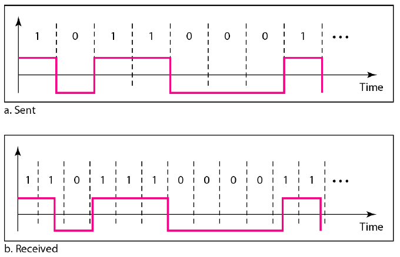

# Communication Channel Abstrication

__Packets -> Bits -> Signals -> Bits -> Packets__

# Analog signal is nature
- Transmitting over a wire, we can send dignal at different voltage levels, and the receiver can measure the voltage to determine what the sender transmitted.   EX:
    - Black-and-white analog TV use the voltage waveform to represt the shade of gray of the picture.
    - Analog phone convert sound wave to electrical signal and back.
- Transmitting over an optical communication link, we can send signal in different intensities and/or wavelength.

# But digital is better for communication
- Easy to modularize and build large system.
- Digital data processing technique can improve the quality and performance of the system.

# There is no error-free communication channel
- tolerance of internal components
- environmental factors: temperature, power supply votlage
- interference from other transmissions

# Map Bits to Signals
- Voltage __V0__ for bit __0__; __V1__ for bit __1__.
- The bigger range of input voltage, or the longer period of time that voltage hold, the bigger tolerance of uncertainty.
- The boundary between __0__ and __1__ ((V0+V1)/2) calls the _threshold voltage_, __Vth__.
- The receiver can output any value when the input voltage is in the 'range' of __Vth__.

# Sender and Receiver synchronization
- The peer of sender and receiver need to aggree the same ___sample rate___ and ___clock rate___ in communication.
- Both the sender and receiver use its internal clock to determine when to generate or acquire the next voltage sample. And both use counters to keep track of how many samples there are in each bit.  
- If their clock don't exactly match, for example, the sender sending 5 samples per bit, but receiver's clock is a little slower, the receiver will seems to be transmitting faster, it may receive 4.999 samples per bit. Similarly, if receiver's clock is a little faster, the sender will seems to be transmitting slower, e.g., transmite at 5.001 samples per bit.

- __Sample Rate__: The number of samples per second.
    - Nyquist showed the minimum sample rate must be 2 times of higest signal frequency.
- __Clock Rate__: The number of clock cycle per second __(Hz)__.
   

# Communication Channel
A channel is viewed in terms of its possible inputs (_x_), its possible outpus (_y_), and how the input affect the output (_P(y|x)_).
- _P(y|x)_ is the _conditional probability_ of _y_ when given the _x_.

# Channel Capacity
The channel capacity represents the maximum amount of information that can be transmitted by a channel per second.
> Information Rate (R): (symbols per second) * (information bits per symbol)  
> = sample rate * entropy.

## Data Rate Limits
The maximum data rate limit over a medium is decided by following factors:
- __B__ Bandwidth of channel 
    - the range of frequency (Hz)
    - data rate (bits per second)
- __S__ Signal power levels 
- __N__ Channel quality (level of noise)

## Noiseless Channel
- __Nyquist theorem__ showed that to produce the original analog signal, the sample rate must be at least twice the higest frequency in the original signal.
__Nyquist sample rate = 2 x fmax__

The maximum bit rate = 2 x B * log2L

where:
- B: Bandwidth of channel (Hz)
- L: the number of bits (singal levels) per sample

## Shannon Capacity (Noisy Channel)
__C = B * log2(1+S/N)__ bits/s

where:
- C: Channel capacity (bits per second)
- B: Bandwidth of channel (Hz)
- S/N: signal to noise ratio (SNR), S: received signal, N: noise

> Information Rate (R) = Sample Rate * Entropy = (sample/sec) * (bits/sample)  
> C = 2B * log2&radic;(1+S/N)  
> = 1/2 * 2B * log2(1+S/N)  
> = B * log2(1+S/N)

### Decibel (dB)
- The decibel (dB) measures the relative strength of two signals.
- The decibel is positive if signal sttrengthened, and it is negative when signal attenuates.
__dB = 10 log10(P2/P1)__

> EX: SNR  
> The power of signal is 10 mW, and the power of noise is 1 &mu;W  
> SNR = 10000 &mu;W / 1 &mu;W = 10000.  
> SNRdB = 10 * log1010000 = 10 * log10104 = 40.  

### Tradeoffs
- Increase bandwidth or signal power, increase data rate.
- Increase of noise, reduce data rate.
- Increase bandwidth, allow more noise.
