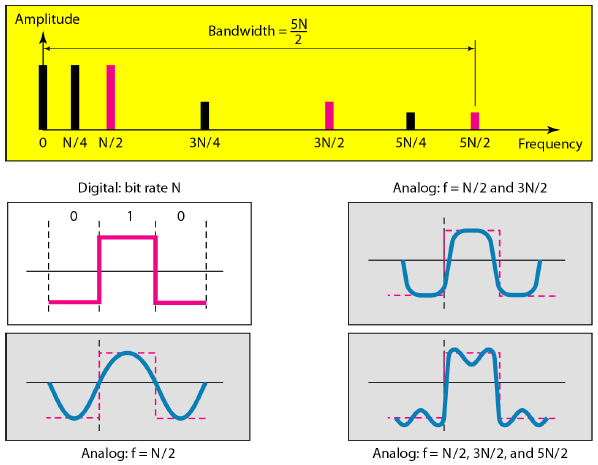

Please refer to textbook .

# Digital Signal
- Use digital bits (0/1) to encode voltage levels.
- N levels need log2N bits.

- most digital signals are ___nonperiodic___, so __periodic__ and __frequency__ are not appropriate characteristics.
- __Bit rate__ is the number of bits in 1 second (bps).
  > EX:  
  > HDTV - 1920x1080 pixels a picture, 24 bits colors per pixcel, and 30 frames per second.  
  > The bit rate is 1920 x 1080 x 30 x 24 &asymp; 1.5 Gbps  
  >  
  > EX:  
  > In a 4k Hz bandwidth analog voice signal, we sample the signal twice the higest frequency (2 samples per hertz), and each sample needs 8 bits, then the bit rate is:  
  > 2 x 4000 x 8 = 64000 = 64 kbps.  
  
- __Bit interval__ is the inverse of the bit rate (second).
  > EX:  
  > A signal has a bit rate of 2000 bps, its bit interval is  
  > 1/2000s = 0.0005s = 500 &mu;s  
  >  
  
  
- __Bit length__ is the distance one bit occupies on the transmission medium. (The concept of __wavelength__ in analog signals)

## Digital Signal as a Composite Analog Signal
- based on __Fourier analysis__, a digital signal is a composite analog signal, which the bandwidth is infinite.
  - __Fourier__ showed that a composite periodic signal can be decomposited into a serial of sine and cosine functions which called ___Fourier series___.  
  
  - A digital signal composited by infinite number of frequency of signals, so its bandwidth is infinite.
  - a horizon line in the time domain, no changes in time, means a frequency of 0.
  - a vertical line in the time domain means a frequency of infinity.

## Transmission of Digital Signals

- __Baseband Transmission (without modulation)__
  - __Low-pass__ channel has bandwidth with frequencies between 0 and f.
  - signal that has a very narrow and near-zero frequency range
- __Broadband Transmission (using modulation)__
  - __Band-pass__ channel has bandwidth with frequencies between f1 and f2.
