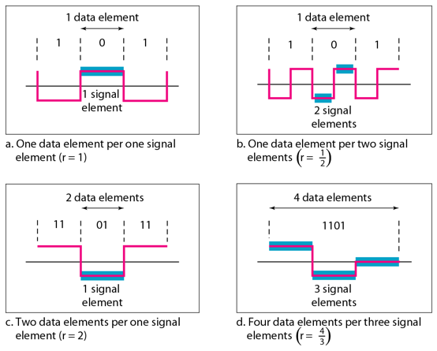
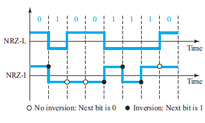

Please refer to textbook [chapter 4](https://github.com/cnchenpu/data-comm/blob/master/ppt/Ch4-Forouzan.ppt).

# Digital to Digital Conversion

## Data vs. Signal Element
- Data element: a bit that represent a piece of information.
- Signal element: the shortest unit of a digital signal.
- data elements per signal elements: __r = data elements / signal elements__

- Data rate (N): the number of data elements (bits) send in one second __(bps)__.
- Signal rate (S): the number of signal elements send in one second __(baud)__.
- Signal rate also called _pulse rate_, _modulation rate_ or _baud rate_.
> Signal rate __S = N/r__  
> or in average __S = c x N x 1/r__  
> where __c__ is the case factor.

## Bandwidth: The baud rate determines the required bandwidth for a digital signal.
- So the minimum bandwidth is signal rate: __Bmin = c x N x 1/r__
- The [Nyquist sample rate](https://github.com/cnchenpu/data-comm/blob/master/08_data-comm_channel.md#noiseless-channel) shows the maximum data rate of a channel is __Nmax = 2 x B x log2L__.
> - A signal with L levels actually can carry log2L bits per level,  
> - if each level corresponds to 1 single element, and in average case (c = 1/2).  
> Then:  
> __Nmax = 1/c x B x 1/r = 2 x B x log2L__

### Baseline: the average signal power that receiver to decode a digital signal.
- The incoming signal power is evaluated against the baseline to determine the value of the data element.
- A long string of 0s or 1s could cause a drift in the baseline (__baseline wandering__) and make it difficult for the receiver to decode correctly.

### Synchronization
- To correctly interpret the signals received from the sender, the receiver’s bit intervals must correspond exactly to the sender’s bit intervals.

## Line Coding Schemes
- Unipolar - NRZ
- Polar - NRZ, RZ, and biphase (Manchester, and differential Manchester)
- Bipolar - AMI and pseudoternary
- Multilevel - 2B/1Q, 8B/6T, and 4D-PAM5
- Multitransition - MLT-3

### Unipolar NRZ (Non Return to Zero)
- The signal does not return to zero at the middle of the bit.
- positive voltage defines bit 1, zero voltage defines bit 0.  

### Polar NRZ-Level & NRZ-Invert
- The bit 0 and 1 are in different voltage polar.
- NRZ-L, the level of voltage determines the value of the bit.
- NRZ-I, the change or the lack of change in the level of voltage determines the value of the bit.

