Please refer to textbook [chapter 4](https://github.com/cnchenpu/data-comm/blob/master/ppt/Ch4-Forouzan.ppt).

# Signal Encoding Techniques
There are 4 possible combinations of encoding techniques:
- __Digital data, digital signal__
- __Digital data, analog signal__
- Analog data, digital signal
- Analog data, analog signal

# Digital to Digital Conversion (Digital data, digital signal)
- Digital signal:
  - Discrete, discontinuous voltage pulses
  - Each pulse is a __signal element__
  - Binary data encoded to signal elements

## Data vs. Signal Element
- Data element: a bit that represent a piece of information.
- Signal element: the shortest unit of a digital signal.
- data elements per signal elements: __r = data elements / signal elements__

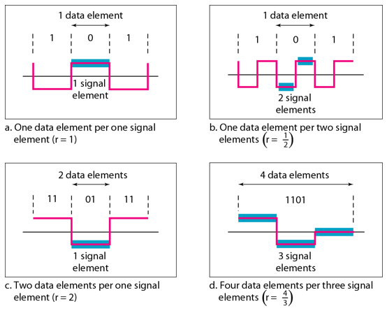

- Data rate (N): the number of data elements (bits) send in one second __(bps)__.
- Signal rate (S): the number of signal elements send in one second __(baud)__.
- Signal rate also called _pulse rate_, _modulation rate_ or _baud rate_.
> Signal rate __S = N/r__  
> or in average __S = c x N x 1/r__  
> where __c__ is the case factor.

## Bandwidth: The baud rate determines the required bandwidth for a digital signal.
- So the minimum bandwidth is signal rate: __Bmin = c x N x 1/r__
- The [Nyquist sample rate](https://github.com/cnchenpu/data-comm/blob/master/08_data-comm_channel.md#noiseless-channel) shows the maximum data rate of a channel is __Nmax = 2 x B x log2L__.
> - A signal with L levels actually can carry log2L bits per level,  
> - if each level corresponds to 1 single element, and in average case (c = 1/2).  
> Then:  
> __Nmax = 1/c x B x 1/r = 2 x B x log2L__

### Baseline: the average signal power that receiver to decode a digital signal.
- The incoming signal power is evaluated against the baseline to determine the value of the data element.
- A long string of 0s or 1s could cause a drift in the baseline (__baseline wandering__) and make it difficult for the receiver to decode correctly.

## Interpreting Signals
- Receiver needs to know
  - Timing of bits - when they start and end
  - Signal levels
- What factors determine how successful the receiver will be interpreting the incoming signal?
  - Signal to noise ratio
  - Data rate
  - Bandwidth
  - Encoding Scheme

### Synchronization
- To correctly interpret the signals received from the sender, the receiver’s bit intervals must correspond exactly to the sender’s bit intervals.  
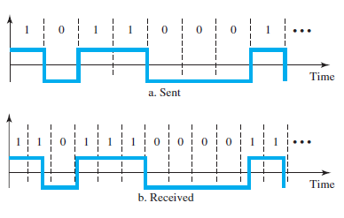

## Line Coding Schemes
### Objects
- __Signal Spectrum__
  - Desire no high frequency components so less bandwidth is required.
  - Desire no DC components to reduce bits error rate.
  - Concentrate transmitted power in middle of bandwidth.
- __Clocking and Synchronization__
  - Transmitted signal can be used by receiver to synchronize bit timing.
- __Error Detection__
  - Receiver can detect some bit error from the received signal.
- __Signal Interference__
  - Provide good performance (few bit error) in presence of noise.
- __Cost and Complexity__
  - Desire smaller signaling rate to achieve a given data rate.

### Subjects:
- Unipolar - NRZ
  - All signal elements have same sign, i.e. all positive or all negative
- Polar - NRZ, RZ, and biphase (Manchester, and differential Manchester)
  - One logic state represented by positive voltage the other by negative voltage
- Bipolar - AMI and pseudoternary
- Multilevel - 2B/1Q, 8B/6T, and 4D-PAM5
- Multitransition - MLT-3

### Unipolar NRZ (Non Return to Zero)
- The signal does not return to zero at the middle of the bit.
- Positive voltage defines bit 1, zero voltage defines bit 0. 
- Pros
  - Easy to engineer
  - Make efficient use of bandwidth
- Cons
  - DC component
  - Lack of synchronization capability
- Used for magnetic recording
- Not often used for signal transmission  
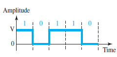

### Polar NRZ-Level & NRZ-Invert
- The bit 0 and 1 are in different voltage polar.
- NRZ-L, the level of voltage determines the value of the bit.
- NRZ-I, the change or the lack of change in the level of voltage determines the value of the bit.  
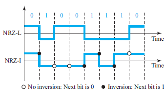

### RZ (Return to Zero)
- The main problem with NRZ encoding occurs when the sender and receiver clocks are not synchronized. The receiver does not know when one bit has ended and the next bit is starting. One solution is RZ scheme.
- The signal changes not between bits but during bits.
- The signal goes to 0 in the middle of each bit, and remains there until the beginning of the next bit.  
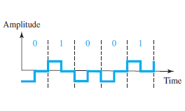

### Biphase: Manchester and Differential Manchester
- The idea of RZ (transition at the middle of the bit) and the idea of NRZ-L are combined into the Manchester scheme.
- The duration of the bit is divided into two halves. The voltage remains at one level during the first half and moves to the other level in the second half.
- The transition at the middle of the bit provides synchronization.
- Differential Manchester, on the other hand, combines the ideas of RZ and NRZ-I.
- There is always a transition at the middle of the bit, but the bit values are determined at the beginning of the bit. If the next bit is 0, there is a transition; if the next bit is 1, there is none.  
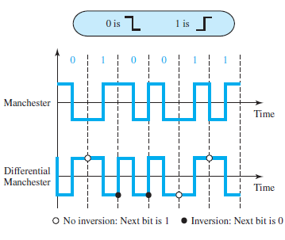

### Differential Encoding
- Data represented by changes rather than levels
- More reliable detection of transition in the presence of noise rather than to compare a value to a threshold level
- In complex transmission layouts it is easy to loose sense of polarity of the signal

### Bipolar: AMI and pseudoternary
- AMI: alternate mark (1) inversion, zero voltage is 0, 1 represented by alternating positive and negative voltages.
- Pseudoternary: 1 bit is encoded as a zero voltage and the 0 bit is encoded as alternating positive and negative voltages.  
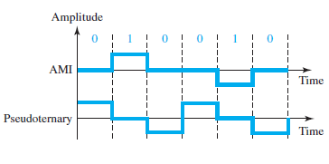

## Summary
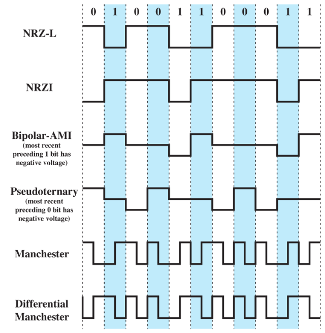

## HW (due date: 10/23)
Draw the digital signal codes:  
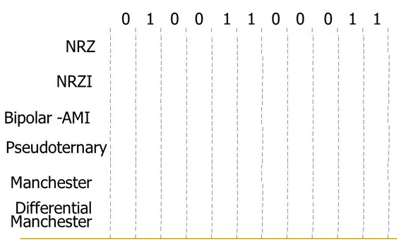

## Multilevel Schemes
- The desire to increase the data speed or decrease the required bandwidth has resulted in the creation of many schemes.
- The goal is to increase the number of bits per baud by encoding a pattern of ___m___ data elements into a pattern of ___n___ signal elements.
- Different types of signal elements can be allowing different signal levels.
- If we have ___L___ different levels, then we can produce ___Ln___ combinations of signal patterns.
- The data element and signal element relation is ___2m &le; Ln___
- ___mBnL___ coding, where m is the length of the binary pattern, ___B___ means binary data, ___n___ is the length of the signal pattern, and ___L___ is the number of levels in the signaling.
  - B (binary, L=2), T (tenary, L=3), and Q (quaternary, L=4).

### 2B1Q (two binary, one quaternary)
- 00:-3, 01:-1, 10:+3, 11:+1.
- Signal rate (baud rate): __S = c x N x 1/r__
  - __S = 1/2 x N x 1/2 = N/4__
  - Signal rate is 2 times faster than NRZ-L
- DSL (Digital Subscriber Line) use 2B1Q for Internet connection with telephone line.  
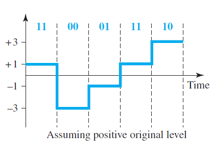

### 8B6T
- Encode a pattern of 8 bits as a pattern of 6 signal elements, where the signal has three levels (ternary).
- 28=256 different data patterns and 36=478 different signal patterns.
  - There are 478-256=222 redundant signal elements that provide synchronization and error detection.
- 8B6T use for Fast Ethernet (100BASE-T)  
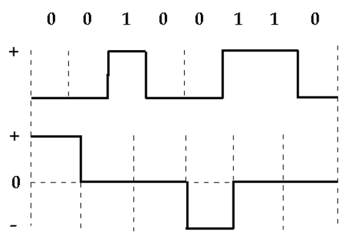

### 4D-PAM5 (Four-dimensional five-level pulse amplitude modulation)
- 4D means that data is sent over four wires at the same time.
- If we assume that the code is just one-dimensional, the four levels create something similar to 8B4Q.
- Gigabit Ethernet use this technique to send 1-Gbps data over four copper cables that can handle 1Gbps/8 = 125Mbaud.  
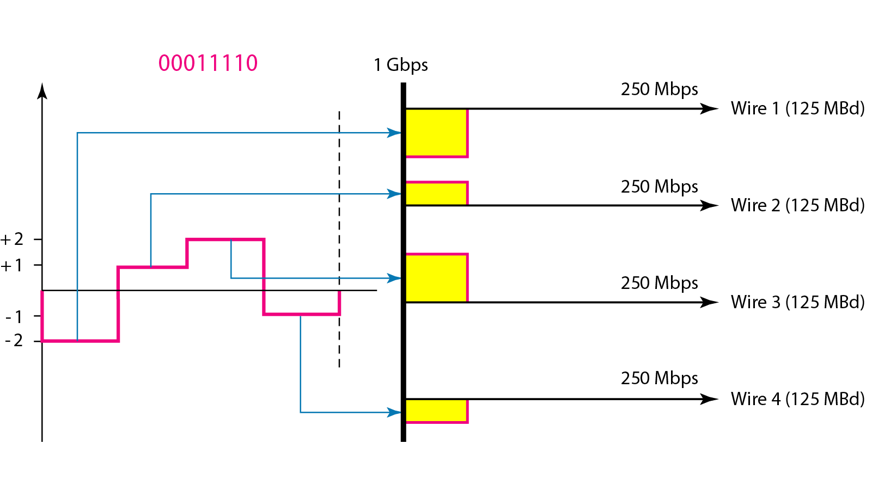

### MLT-3 (Multiline Transmission, 3 level)
- Three levels (+V, 0, and –V) and three transition rules to move the levels
  - If the next bit is 0, there is no transition.
  - If the next bit is 1 and the current level is not 0, the next level is 0.
  - If the next bit is 1 and the current level is 0, the next level is the opposite of the last nonzero level.
- The signal rate for MLT-3 is one-fourth the bit rate (N/4).
- This makes MLT-3 a suitable choice when we need to send 100 Mbps on a copper wire that cannot support more than 32 MHz (frequencies above this level create electromagnetic emission).  
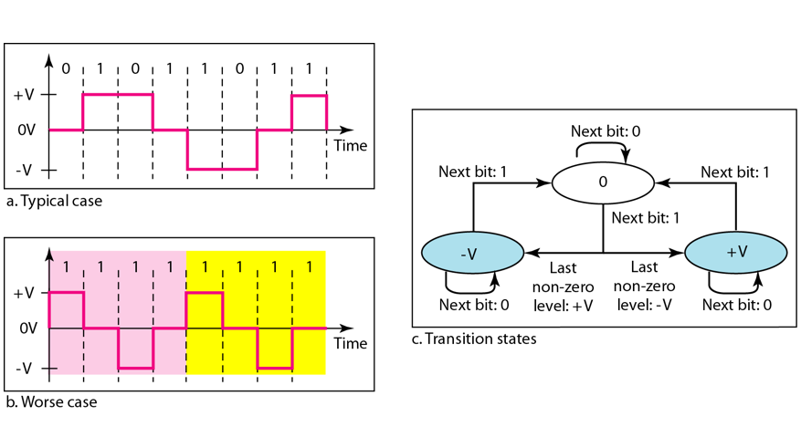

## Summary of line coding schemes
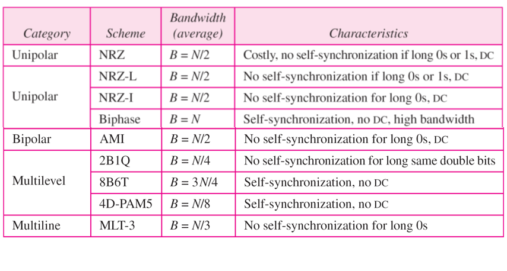

## Block Coding
- Use redundancy to ensure synchronization and to provide some kind of inherent error detecting.
- In general, block coding changes a block of ___m___ bits into a block of ___n___ bits, where ___n___ is larger than ___m___.
- Block coding is referred to as an mB/nB encoding technique.
  - EX: 4B/5B encoding means a 4-bit code for a 5-bit group.  
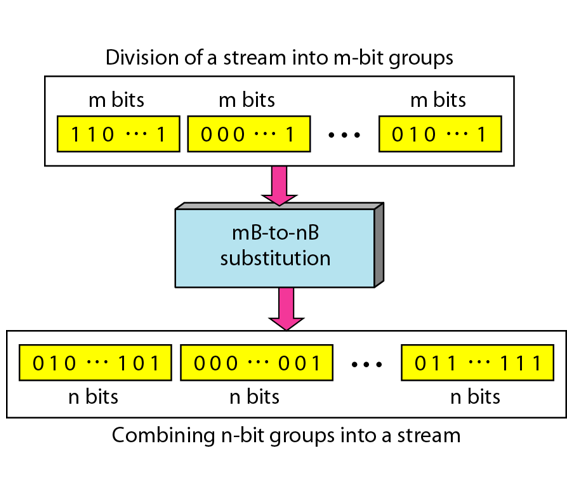

### 4B/5B
- 5-bit output that replaces the 4-bit input
- No more than one leading zero (left bit) and no more than two trailing zeros (right bits).
  - There are never more than three consecutive 0s.
- Using block coding 4B/5B with NRZ-I line coding scheme
  - NRZ-I has a good signal rate, but it has a synchronization problem. A long sequence of 0s can make the
receiver clock lose synchronization.
  - One solution is to change the bit stream, prior to encoding with NRZ-I, so that it does not have a long stream of 0s.  
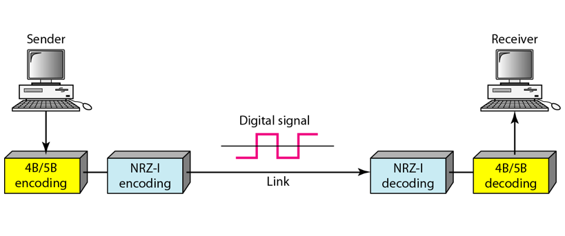

### 8B/10B
- a group of 8 bits of data is substituted by a 10-bit code
- The 8B/10B block coding is actually a combination of 5B/6B and 3B/4B encoding
  - The five most significant bits of a 10-bit block are fed into the 5B/6B encoder; the three least significant bits are fed into a 3B/4B encoder
- better error detection capability than 4B/5B

## Scrambling
- Biphase schemes that are suitable for dedicated links between stations in a LAN are not suitable for long-distance communication because of their wide bandwidth requirement.
- The combination of block coding and NRZ line coding is not suitable for long-distance encoding either, because of the DC component problem.
- Bipolar AMI encoding, on the other hand, has a narrow bandwidth and does not create a DC component. However, a long sequence of 0s upsets the synchronization.
- Scrambling is a way to avoid a long sequence of 0s in the original stream, then we can use bipolar AMI for long distances.
  - if long sequence of same bit, replace with special sequence of bits

### B8ZS (Bipolar with 8-zero substitution)
- Eight consecutive zero-level voltages are replaced by the sequence 000VB0VB.
  - The V in the sequence denotes violation; that is a nonzero voltage that breaks an AMI rule of encoding (opposite polarity from the previous).
  - The B in the sequence denotes bipolar, which means a nonzero level voltage in accordance with the AMI rule.  
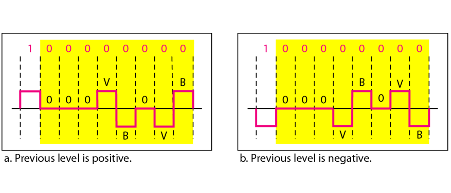

### HDB3 (High-Density Bipolar 3-zero)
- Four consecutive zero-level voltages are replaced with a sequence of 000V or B00V.
  - If the number of nonzero pulses after the last substitution is odd, the substitution pattern will be 000V, which makes the total number of nonzero pulses even.
  - If the number of nonzero pulses after the last substitution is even, the substitution pattern will be B00V, which means makes the total number of nonzero pulses even.
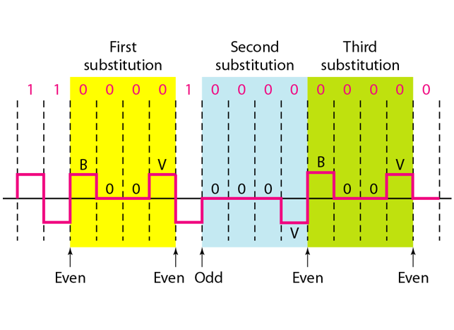

#### Encoding Rules for B8ZS and HDB3
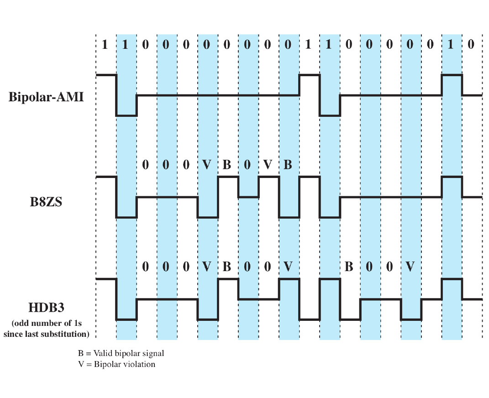

