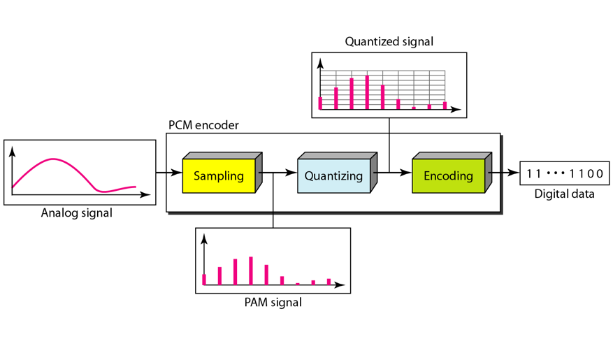
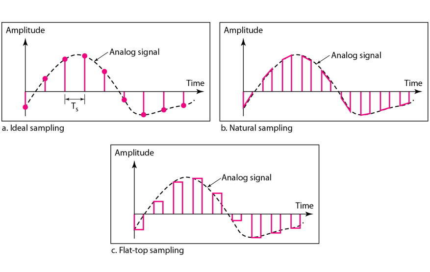
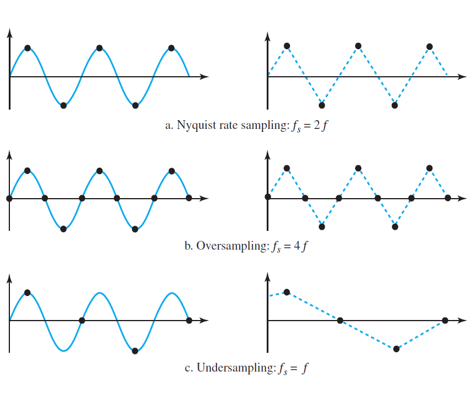
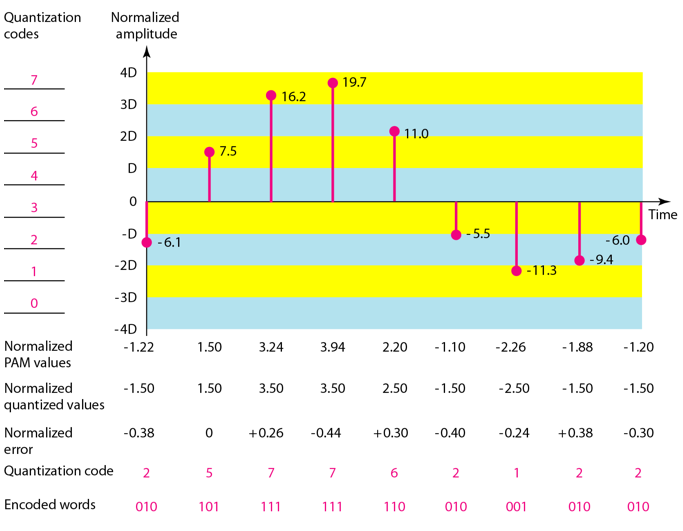
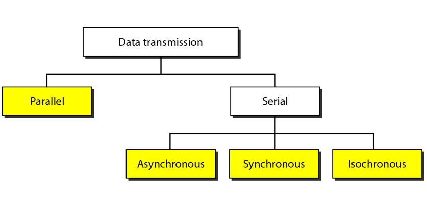

Please refer to textbook [chapter 4](https://github.com/cnchenpu/data-comm/blob/master/ppt/Ch4-Forouzan.ppt).

# Analog to Digital Conversion
## PCM (Pulse Code Modulation)
- 1. The analog signal is sampled.
- 2. The sampled signal is quantized.
- 3. The quantized values are encoded as streams of bits.  

### Sampling
- The analog signal is sampled every Ts seconds, where Ts is the sample interval or period. The inverse of the sampling interval is called the sampling rate or sampling frequency and denoted by fs, where fs = 1/Ts.  
  
- According to the __Nyquist theorem__, the sampling rate must be at least 2 times the highest frequency contained in the signal.  

### Quantization
- approximate the value of the sample amplitude to the quantized values
  - approximate creates qunatization error
- normalized value = actual amplitude / delta
  - delta = (Vmax - Vmin) / Levels  

  
# Transmission Modes  

- Parallel transmission: send bits together
- Serial transmission: send bits one-by-one
  - needs parallel/serial converter
- Asynchronous transmission: use gap (start and end bits) between sending data
- Synchronous transmission: no gaps between sending data
