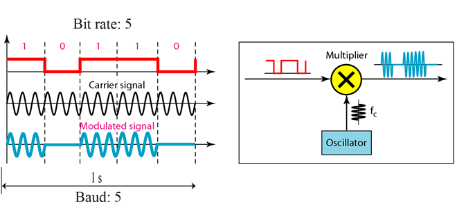
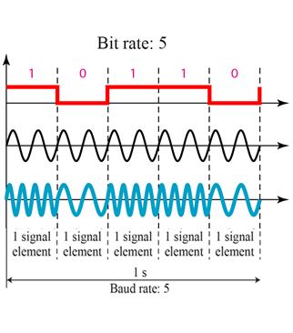
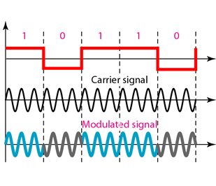
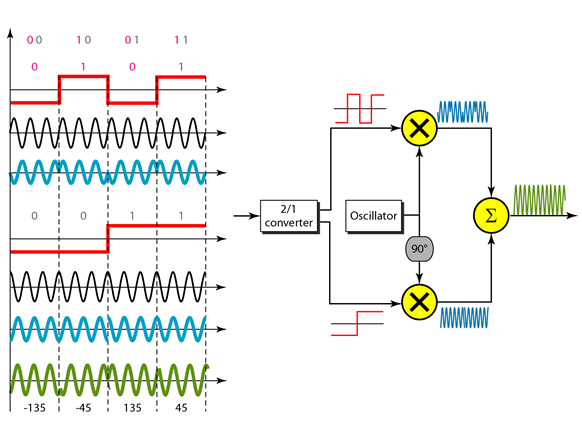

Please refer to textbook [chapter 5](https://github.com/cnchenpu/data-comm/blob/master/ppt/Ch5-Forouzan.ppt).

# Digital to Analog Conversion
- Sine wave characteristics: __amplitude__, __frequency__, and __phase__.
  - By changing these characteristics (conversion) of signal, we can use it to represent digital data.
- Digital information changes the __carrier signal__ by modifying one or more of its characteristics (amplitude, frequency, or phase). This kind of
modification is called modulation (shift keying).
- Type of digital to analog conversion:
  - Amplitude Shift Keying (ASK)
  - Frequency Shift Keying (FSK)
  - Phase Shift Keying (PSK)
  - Quadrature Amplitude Modulation (QAM): combine amplitude and phase shift
 
 > Bit rate (N, data rate): the number of data elements (bits) send in one second (bps)  
 > Boud rate (S, signal rate): the number of signal elements send in one second  
 > r: number of data elements carried in one signal element  
 > S = N x 1/r, or N = S x r.  
 > EX:  
 > An analog signal carries 4 bits per signal element. If 1000 signal elements are sent per second, the bit rate is:  
 > N = S x r = 1000 x 4 = 4000 bps.
 
## Amplitude Shift Keying (ASK)
- In amplitude shift keying, the amplitude of the carrier signal is varied to create signal elements. Both frequency and phase remain constant while the amplitude changes.  

## Frequency Shift Keying (FSK)
- In frequency shift keying, the frequency of the carrier signal is varied to represent data. The frequency of the modulated signal is constant for the duration of one signal element, but changes for the next signal element if the data element changes. Both peak amplitude and phase remain constant for all signal elements.  

## Phase Shift Keying (PSK)
- In phase shift keying, the phase of the carrier is varied to represent two or more different signal elements. Both peak amplitude and frequency remain constant as the phase changes.  

- QPSK uses two carriers, one in-phase and the other quadrature.  

## Quadrature Amplitude Modulation (QAM)
- Combine ASK and PSK, using two carriers, one in-phase and the other quadrature, with different amplitude levels for each carrier.  
