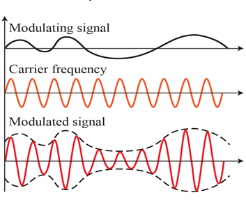
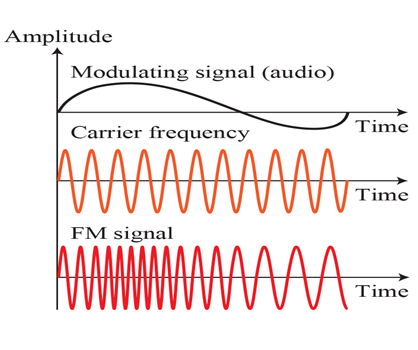
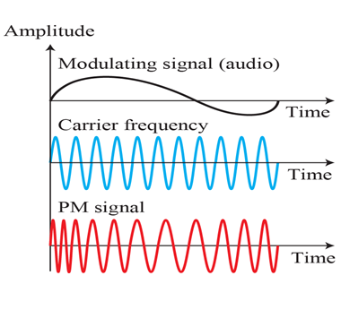

Please refer to textbook [chapter 5](https://github.com/cnchenpu/data-comm/blob/master/ppt/Ch5-Forouzan.ppt).

# Analoge to Analoge Conversion
- Amplitude Modulation (AM)
- Frequency Modulation (FM)
- Phase Modulation (PM)

## Amplitude Modulation (AM)
- The carrier signal is modulated so that its amplitude varies with the changing amplitudes of the modulating signal.  

## Frequency Modulation (FM)
- The frequency of the carrier signal is modulated to follow the changing voltage level (amplitude) of the modulating signal.  

## Phase Modulation (PM)
- The phase of the carrier signal is modulated to follow the changing voltage level (amplitude) of the modulating signal.  

