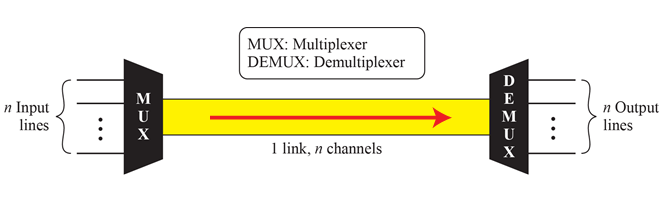
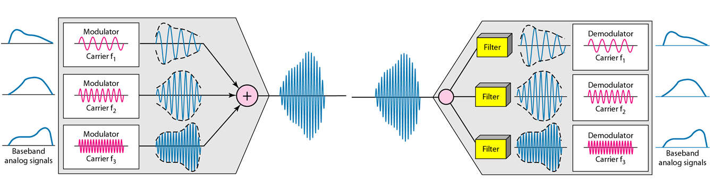
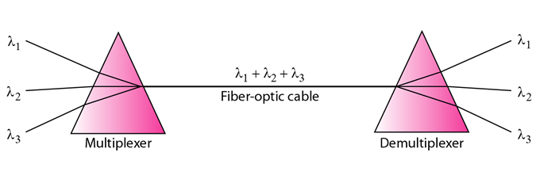
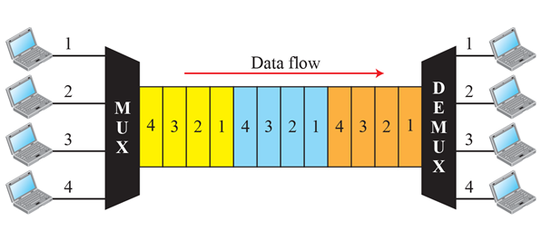
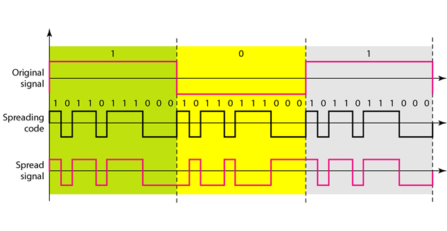

Please refer to textbook [chapter 6](https://github.com/cnchenpu/data-comm/blob/master/ppt/Ch6-Forouzan.ppt).

# Multiplexing
Multiplexing is the set of techniques that allow the simultaneous transmission of multiple signals across a single data link.
- Frequency-division multiplexing (FDM)
- Wavelength-division multiplexing (WDM)
- Time-division multiplexing (TDM)  

## Frequency-division multiplexing (FDM)
- In FDM, signals generated by each sending device modulate different carrier frequencies. 
- These modulated signals are then combined into a single composite signal that can be transported by the link.  

## Wavelength-division multiplexing (WDM)
- The optical fiber data rate is higher than the data rate of metallic transmission cable, 
- Using a fiber-optic cable for a single line wastes the available bandwidth. 
- Multiplexing allows us to combine several lines into one.  

## Time-division multiplexing (TDM)
- Each connection occupies a portion of time in the link.  

# Spread Spectrum
- In wireless communication we have some concerns that outweight bandwidth efficiency.
- Spread specturm technique use to protect signal transmiting in air.
- Frequency Hopping Spread Spectrum (FHSS)
  - FHSS uses M different carrier frequencies that are modulated by the source signal. 
  - At one moment, the signal modulates one carrier frequency; at the next moment, the signal modulates another carrier frequency.
- Direct Sequence Spread Spectrum (DSSS) 
  - In DSSS, we replace each data bit with n bits using a spreading code. 
  - In other words, each bit is assigned a code of n bits, called chips.  
  
