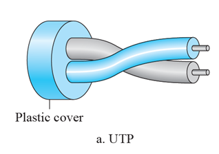
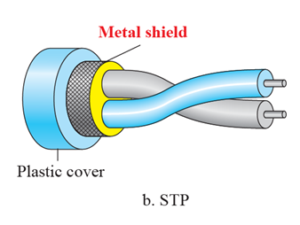
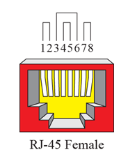
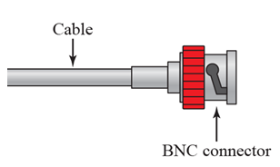

Please refer to textbook [chapter 7](https://github.com/cnchenpu/data-comm/blob/master/ppt/Ch7-Forouzan.ppt).

# Transmission media 
- Guided (wired)
  - twisted-pair cable
  - coaxial cable
  - fiber-optic cable
- Unguided (wireless)
  - radio wave
  - microwave
  - infrared

