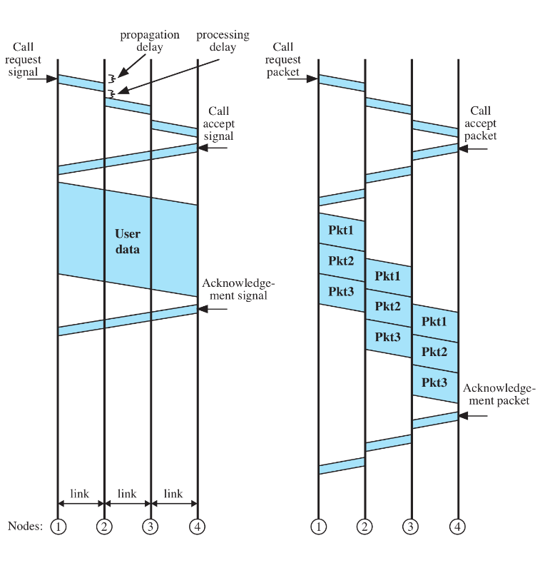

Please refer to textbook [chapter 8](https://github.com/cnchenpu/data-comm/blob/master/ppt/Ch8-Forouzan.ppt).

# Switching
- Circuit Switching
- Packet Switching
  - Virtual-Circuit approach 
  - Datagram approach
- Message Switching

## Circuit Switching
- PSTN (Public Switched Telephone Network)
- Connection Oriented
  - Path established before data transfer begins
  - Channel capacity must be reserved between each pair of nodes in path
- Utility is not efficient but delay is minimal 
- Quality (data rate and delay) guaranteed for duration of connection  

## Packet Switching
- VoIP
- Connectionless
- Devide messages into packets before sending
- Assember packets into messages after received
- Each packet is treated independently of all others
  - Packets belonging to the same message may:
    - Take different paths across the network
    - Arrive at destination out of order and may be lost
- Packets need headers so switches know where to send them

### Datagram packet switching
- Each packet (datagram) is treated as a separate entity.
- Each packet is routed independently through the network.
- Therefore packets contain a header with the full information about the destination.
  - Routing: 
    - The intermediate nodes examine the header of a packet and select an appropriate link to another node which is nearer to the destination.
    - The intermediate nodes do not require prior knowledge of the routes that will be used.
- A datagram network is a best effort network (ex: IP). Delivery is not guaranteed. Reliable delivery must be provided by using additional protocols (ex: TCP). 

### Virtual Circuit switching
- The path is determinted before data transfer begins.
  - All intermediate nodes have well defined routing table. 
- Once setup, data is transferred as individual packets
  - Take the same path across the network
  - Arrive in-order at the destination, but may be lost
  
#### Event Timing for Circuit and Packet Switching

