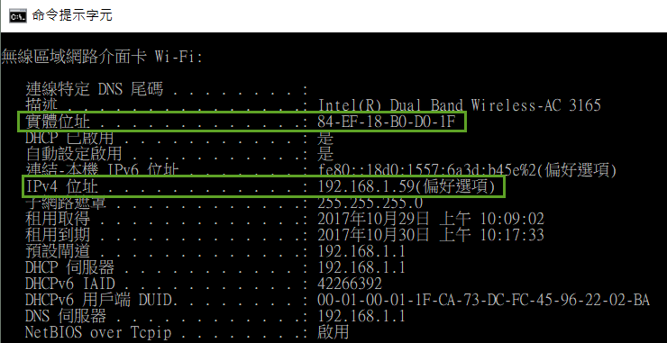
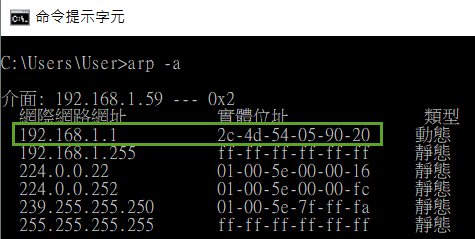
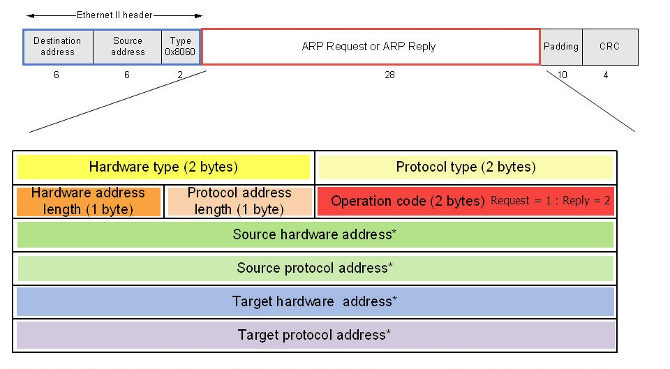

# Lab 1: Packet Sniffing 
Use Wireshark to learn how to do packet sniffing.

Download: 

An illustration of capture an incomming frame:  

Packet sniffer structure:  

## ipconfig & arp

Start the Wireshark:  

## ARP 
ARP packet format:  
 

ARP Request:  

ARP Reply:  

