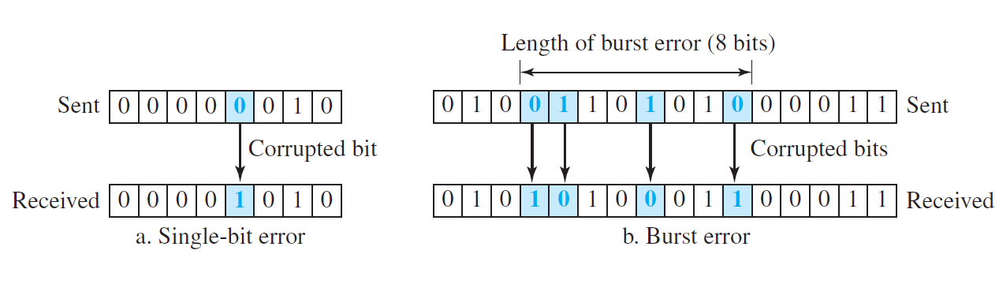
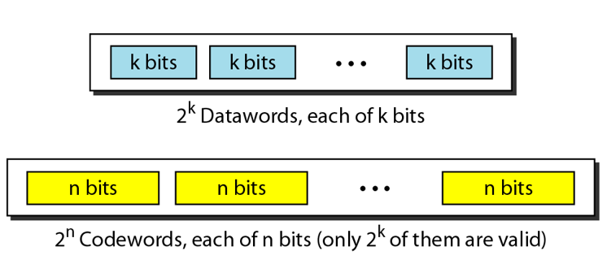
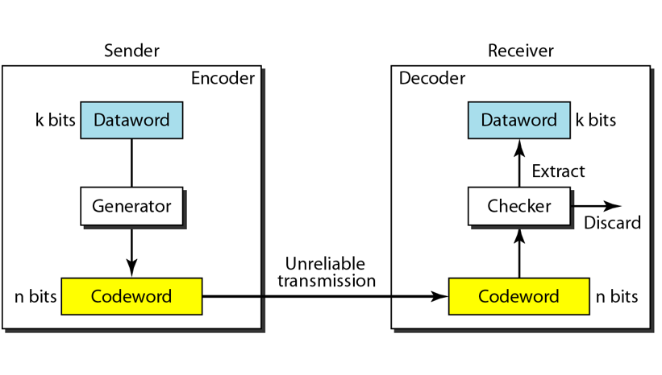
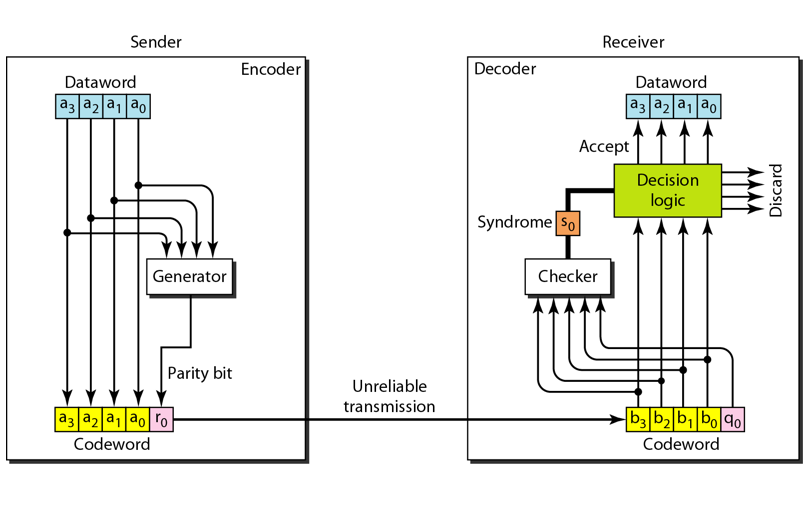
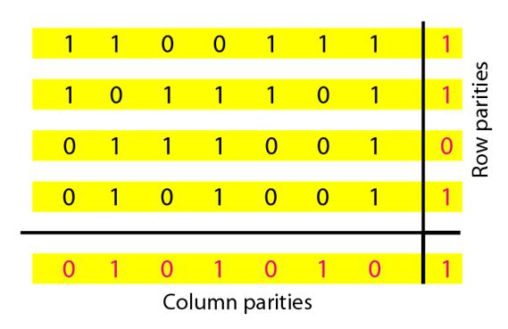
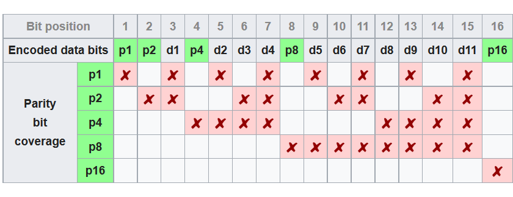

Please refer to textbook [chapter 10](https://github.com/cnchenpu/data-comm/blob/master/ppt/Ch10-Forouzan.ppt)

# Data-Link Layer Error Detection and Correction
- Error transmissions are caused by __Interference__, type of errors:
  - single bit error
  - burst error  

- To detect or correct errors, we need to send extra (__Redundant__) bits with data.
- __Error detection__
  - Looking only to see if any error has occurred
  - The answer is a simple yes or no.
- __Error correction__
  - Forward error correction
    - The process in which the receiver tries to guess the message by using redundant bits.
  - Retransmission
    - The receiver detects the occurrence of an error and asks the sender to resend the message.
- Redundancy is achieved through various __coding schemes__.
  - redundant bits: n > k
  
  
  > EX:  
  > [4B/5B](https://github.com/cnchenpu/data-comm/blob/master/11_data-comm_digital-trans_D2D.md#4b5b) block coding  
  > 24 = 16 data-words  
  > 25 = 32 code-words  

## Error Detection
  
EX:
As following code table
- If received __111__, there there is no valid code-word matched, so discard it.
- If received __000__, this is a vaild code-word in code table, the data-word is __00__.
- If sender sent __000__ but receiver received __011__ (2 bits corrupted), then it will not be detected and treat as data-word __01__.
- __An error-detecting code can detect only the types of errors for which it is designed; other types of errors may remain undetected.__

|Data-word|Code-word|
|:----:|:----:|
|00|000|
|01|011|
|10|101|
|11|110|

## Error Correction
EX: 
As following code table, sender sends __01011__ (__data-word: 01__) but receiver receives __01001__.
- Receiver finds the code-word is not in the code table, that means an error has occurred.
  - Assume there is only __1 bit corrupted__.
  - Compare the received code-word with the code-words in the table.
  - Then find the code-word __01011__ in table has 1 bit that differ from the received code-word __01001__.
  - So correct the received code-word to __01001__, and consult the data-word is __01__.

|Data-word|Code-word|
|:----:|:----:|
|00|00000|
|01|01011|
|10|10101|
|11|11110|

## Hamming Distance
- The Hamming distance between two words (of the same size) is the number of differences between the corresponding bits.
- To measure the difference between two strings is the central concept in coding for __error control__.
  - If the Hamming Distance between the sent and the received codeword is not zero, the codeword has been corrupted during transmission.
- The Hamming distance can easily be found if we apply the ___XOR___ (&oplus;) operation on the two words and count the number of 1s in the result.  
   
  |A|B|XOR|
  |:---:|:---:|:---:|
  |0|0|0|
  |0|1|1|
  |1|0|1|
  |1|1|0|
  
### Minimum Hamming Distance for Error Detection
- EX.1

|Code-word|Code-word|Hamming Distance|
|:----:|:----:|:----:|
|000|011|2|
|000|101|2|
|000|110|2|
|011|101|2|
|011|110|2| 
|101|110|2| 

  - The minimal Hamming distance dmin = 2.
    - Cna only detect 1 error bit.

- EX.2 

|Code-word|Code-word|Hamming Distance|
|:----:|:----:|:----:|
|00000|01011|3|
|00000|10101|3|
|00000|11110|4|
|01011|10101|4|
|01011|11110|3| 
|10101|11110|3| 

  - The minimal Hamming distance dmin = 3.
    - Can only detect 2 error bit.
    - Can only correct 1 error bit.

- To guarantee the __detection__ of up to __s errors__ in all cases, the __minimum Hamming distance__ in a block code must be __dmin = s + 1__.
- To guarantee the __correction__ of up to __t errors__ in all cases, the __minimum Hamming distance__ in a block code must be __dmin = 2t + 1__.

## Linear Block Codes
- A linear block code is a code in which the exclusive OR (XOR) of two valid codewords creates another valid codeword.
> Above two examples are linear block code.

## Simple Parity Check
- EX: C(5,4)

|Data-word|Code-word|Data-word|Code-word|
|:----:|:----:|:----:|:----:|
|0000|0000 <b>0</b>|1000|1000 <b>1</b>|
|0001|0001 <b>1</b>|1001|1001 <b>0</b>|
|0010|0010 <b>0</b>|1010|1010 <b>0</b>|
|0011|0011 <b>0</b>|1011|1011 <b>1</b>|
|0100|0100 <b>1</b>|1100|1100 <b>0</b>|
|0101|0101 <b>0</b>|1101|1101 <b>1</b>|
|0110|0110 <b>0</b>|1110|1110 <b>1</b>|
|0111|0111 <b>1</b>|1111|1111 <b>0</b>|

- A simple parity-check code is a single-bit error-detecting code in which n = k + 1 with dmin = 2

- r0 = a3 + a2 + a1 + a0 (modulo-2)
- s0 = b3 + b2 + b1 + b0 + q0 (modulo-2)

- A simple parity-check code can detect an odd number of errors.

## Two-Dimensional Parity-Check

## Hamming code
The goal of the Hamming codes is to create a set of parity bits that overlap such that a single-bit error in a data bit or a parity bit can be detected and corrected.

EX: 10011010

|Bit position|1|2|3|4|5|6|7|8|9|10|11|12|
|:----:|:----:|:----:|:----:|:----:|:----:|:----:|:----:|:----:|:----:|:----:|:----:|:----:|
|__Encoded data bit__|p1|p2|d1|p3|d2|d3|d4|p4|d5|d6|d7|d8|
||||||||||||||

### Encode
- step 1. 
  - Put data bits in position: 3, 5, 6, 7, 9, 10, 11, 12.

|Bit position|1|2|3|4|5|6|7|8|9|10|11|12|
|:----:|:----:|:----:|:----:|:----:|:----:|:----:|:----:|:----:|:----:|:----:|:----:|:----:|
|__Encoded data bit__|p1|p2|d1|p3|d2|d3|d4|p4|d5|d6|d7|d8|
||||1||0|0|1||1|0|1|0|

- step 2.
  - p1 = XOR of bit position (1, 3, 5, 7, 9, 11)  
       = XOR (p1, 1, 0, 1, 1, 1) = 0

|Bit position|1|2|3|4|5|6|7|8|9|10|11|12|
|:----:|:----:|:----:|:----:|:----:|:----:|:----:|:----:|:----:|:----:|:----:|:----:|:----:|
|__Encoded data bit__|p1|p2|d1|p3|d2|d3|d4|p4|d5|d6|d7|d8|
||||1||0|0|1||1|0|1|0|

- step 3. 
  - p2 = XOR of bit position (2, 3, 6, 7, 10, 11)  
       = XOR (p2, 1, 0, 1, 0, 1) = 1
  
|Bit position|1|2|3|4|5|6|7|8|9|10|11|12|
|:----:|:----:|:----:|:----:|:----:|:----:|:----:|:----:|:----:|:----:|:----:|:----:|:----:|
|__Encoded data bit__|p1|p2|d1|p3|d2|d3|d4|p4|d5|d6|d7|d8|
|||1|1|||0|1|||0|1||

- step 4. 

|Bit position|1|2|3|4|5|6|7|8|9|10|11|12|
|:----:|:----:|:----:|:----:|:----:|:----:|:----:|:----:|:----:|:----:|:----:|:----:|:----:|
|__Encoded data bit__|p1|p2|d1|p3|d2|d3|d4|p4|d5|d6|d7|d8|
||||1||0|0|1||1|0|1|0|

