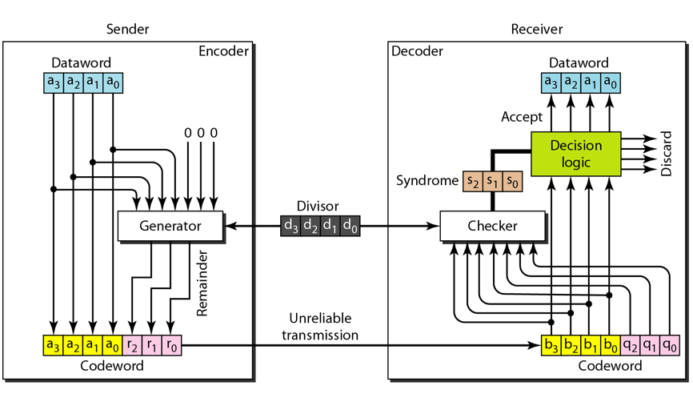
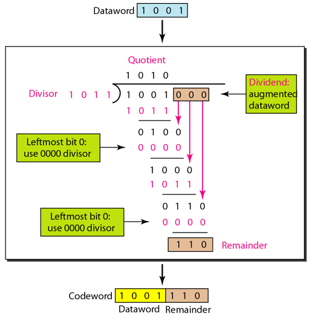
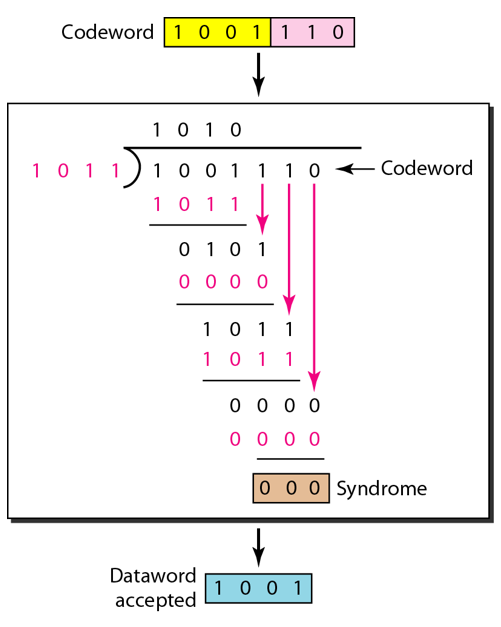
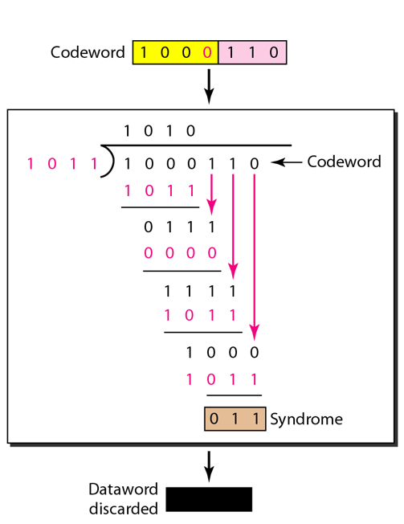

Please refer to textbook [chapter 10](https://github.com/cnchenpu/data-comm/blob/master/ppt/Ch10-Forouzan.ppt).

# Data-Link Layer - Cyclic Codes
The codeword is cyclically shifted (rotated) to become another codeword.  
EX: If 1011000 is a codeword and we cyclically left-shift, then 0110001 is also a codeword.

## CRC (cyclic redundancy check)
- EX: A CRC code with C(7,4)

|Data-word|Code-word|Data-word|Code-word|
|:----:|:----:|:----:|:----:|
|0000|0000 <b>000</b>|1000|1000 <b>101</b>|
|0001|0001 <b>011</b>|1001|1001 <b>110</b>|
|0010|0010 <b>110</b>|1010|1010 <b>011</b>|
|0011|0011 <b>101</b>|1011|1011 <b>000</b>|
|0100|0100 <b>111</b>|1100|1100 <b>010</b>|
|0101|0101 <b>100</b>|1101|1101 <b>001</b>|
|0110|0110 <b>001</b>|1110|1110 <b>100</b>|
|0111|0111 <b>010</b>|1111|1111 <b>111</b>|

- EX: 0010110 -> 0101100 -> 1011000 -> 0110001 ...

### CRC encoding

### CRC decoding

### CRC detect error

