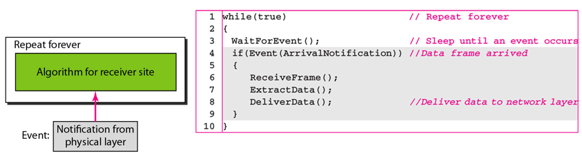
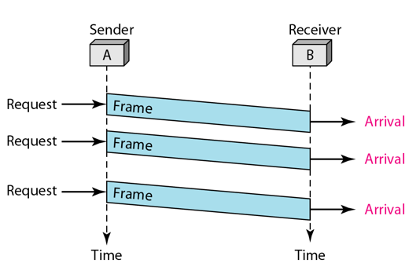

Please refer to textbook [chapter 11](https://github.com/cnchenpu/data-comm/blob/master/ppt/Ch11-Forouzan.ppt). <br>
Last time we discussed error detection and correction in data link layer, then we are going to talk about __Data Link Contorl__.

# Data Link Control
- Framing
- Flow Control
- Error Control


## Framing (in Data Link Layer)
- Encapsulate datagram from network layer into frame.
- Pack bits from physical layer into frame.
- Use control code (flag) to distinguish each frame.
- If frame is too large (whole message), the retranmission (in error) is very inefficient.


- Problem: Where is the data?
  - EX: 010100111010100100101010100111000100

- The approach of framing
  - Character-Oriented Framing
  - Length Counts (fixed length)
  - Bit-Oriented Framing
  
### Character-Oriented Framing
- Entire transmission is based on a character code (such as ASCII).
- The control code (flag) are also characters.
- Problem: 
  - If data is the control code, how to distinguish them?
  - How to transmit binary data?
- Solution: __Byte Stuffing__
  - Just like escape chacter in strings. 


### Length Counts (fixed lenght)
- Use a header field to give the length of the frame

### Bit-Oriented Framing
- Like __Character-Oriented Framing__ but use bits for data and flag.
- Use __Bit Stuffing__ for the same problems.


## Flow and Error Contorl (in Data Link Layer)
- Flow control refers to a set of procedures used to restrict  the amount of data that the sender can send  before waiting for acknowledgment.
- Error control in the data link layer is based on automatic repeat request, which is the retransmission of data.

### The design of the simplest protocol with no flow or error control 
- Ideal noiseless channel.
- Sender <br>


- Receiver <br>




### Stop-and-Wait
- Add __flow control__ in ideal simple protocol.


- Sender <br>


- Receiver <br>


### Stop-and-Wait ARQ (Automatic Repeat Request)
- __Flow control__ in noise channel.
- Error correction in Stop-and-Wait ARQ is done by keeping a copy of the sent frame and retransmitting of the frame when the timer expires.
- In Stop-and-Wait ARQ, we use sequence numbers to number the frames. The sequence numbers are based on modulo-2 arithmetic.
- In Stop-and-Wait ARQ, the acknowledgment number always announces in modulo-2 arithmetic the sequence number of the next frame expected.


- Sender <br>


```
01  Sn = 0;               // Frame 0 should be sent first
02  canSend = true;       // Allow the first request to go
03  while(true)           // Repeat forever
04  {
05    WaitForEvent();     // Sleep until an event occurs
06    if(Event(RequestToSend) AND canSend)
07    {
08      GetData();
09      MakeFrame(Sn);      // The seqNo is Sn
10      StoreFrame(Sn);     // Keep copy
11      SendFrame(Sn);
12      StartTimer();
13      Sn = Sn + 1;
14      canSend = false;
15    }
16    WaitForEvent();         // Sleep
17    if(Event(ArrivalNotification)         // An ACK has arriver
18    {
19      ReceiveFrame(ackNo);                // Receive the ACK frame
20      if(not corrupted AND ackNo == Sn)   // Valid ACK
21      {
22        Stoptimer();
23        PurgeFrame(Sn-1);                 // Copy is not needed
24        canSend = true;
25      }
26    }
27 
28    if(Event(TimeOut)                     // The timer expired
29    {
30      StartTimer();
31      ResendFrame(Sn-1);
32    }
33  }
```

- Receiver <br>


```
01  Rn = 0;                 // Frame 0 expected to arrive first
02  while(true)
03  {
04    WaitForEvent();       // Sleep until an event occurs
05    if(Event(ArrivalNotification))      // Data frame arrives
06    {
07      ReceiveFrame();
08      if(corrupted(frame));
09        sleep();
10      if(seqNo == Rn)
11      {
12        ExtractData();
13        DeliverData();      // Deliver data
14        Rn = Rn + 1;
15      }
16      SendFrame(Rn);        // Send an ACK
17    }
18  }
```
> EX: <br>
> Frame 0 is sent and acknowledged. <br>
> Frame 1 is lost and resent after the time-out. The resent frame 1 is acknowledged and the timer stops. <br>
> Frame 0 is sent and acknowledged, but the acknowledgment is lost. <br>
> The sender has no idea if the frame or the acknowledgment is lost, so after the time-out, it resends frame 0, which is acknowledged.


