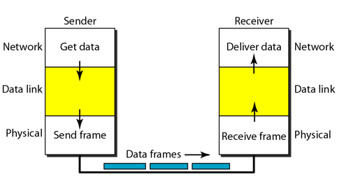
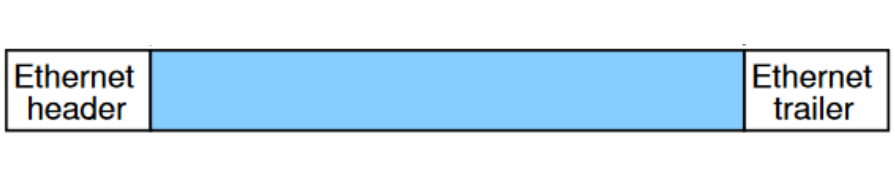
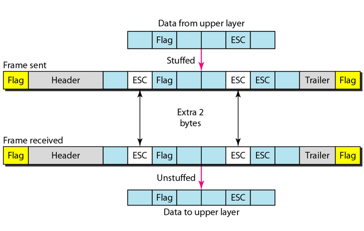
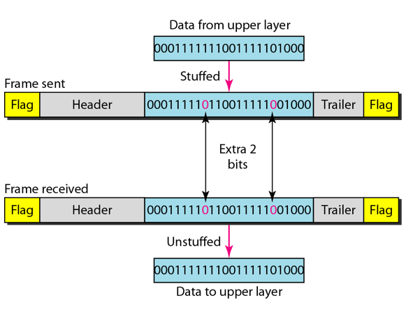
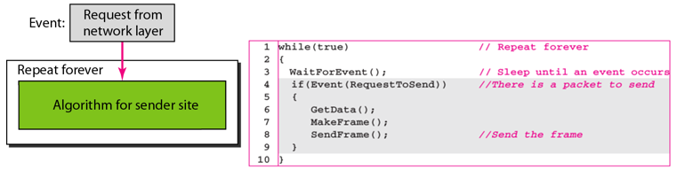
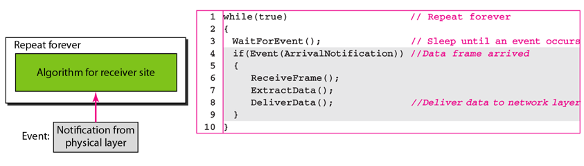
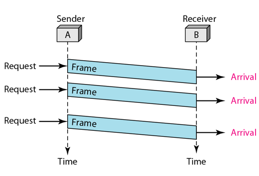
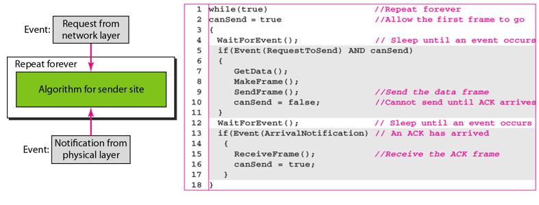
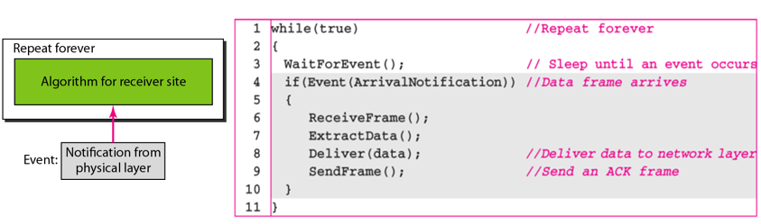
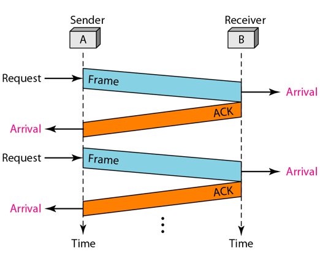

Please refer to textbook [chapter 11](https://github.com/cnchenpu/data-comm/blob/master/ppt/Ch11-Forouzan.ppt).  
Last time we discussed error detection and correction in data link layer, then we are going to talk about __Data Link Contorl__.

# Data Link Control
- Framing
- Flow Control
- Error Control

## Framing (in Data Link Layer)
- Encapsulate datagram from network layer into frame.
- Pack bits from physical layer into frame.
- Use control code (flag) to distinguish each frame.
- If frame is too large (whole message), the retranmission (in error) is very inefficient.

- Problem: Where is the data?
  - EX: 010100111010100100101010100111000100

- The approach of framing
  - Character-Oriented Framing
  - Length Counts (fixed length)
  - Bit-Oriented Framing
  
### Character-Oriented Framing
- Entire transmission is based on a character code (such as ASCII).
- The control code (flag) are also characters.
- Problem: 
  - If data is the control code, how to distinguish them?
  - How to transmit binary data?
- Solution: __Byte Stuffing__
  - Just like escape chacter in strings. 

### Length Counts (fixed lenght)
- Use a header field to give the length of the frame

### Bit-Oriented Framing
- Like __Character-Oriented Framing__ but use bits for data and flag.
- Use __Bit Stuffing__ for the same problems.

## Flow and Error Contorl (in Data Link Layer)
- Flow control refers to a set of procedures used to restrict  the amount of data that the sender can send  before waiting for acknowledgment.
- Error control in the data link layer is based on automatic repeat request, which is the retransmission of data.

### (Ideal) The design of the simplest protocol with no flow or error control 
- Sender  

- Receiver  

### Stop-and-Wait

- Sender  

- Receiver  

