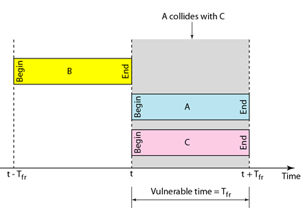

Please refer to textbook [chapter 11](https://github.com/cnchenpu/data-comm/blob/master/ppt/Ch11-Forouzan.ppt). <br>

# Media Access Control
- Lower layer of __Data Link Layer__, provide addressing and shared media access control.
- 1. Random Access (Contension)
- 2. Controlled Access
- 3. Channel Division

## Random Access
- No pirority, no schedule, transmission is selected __randomly__.
- No central supervisor, transmission could have __collision__.
- To solve the collision, every station have to determine:
  - when can access media?
  - what to do if media is busy?
  - transmission success or failure?
  - what to do if collision happened?
  
### ALOHA
- __Multiple Access__ - send as need
- Whenever a terminal has data, it transmits. Sender finds out whether transmission was successful or experienced a collision by listening to the broadcast from the destination station. Sender retransmits after some random time if there is a collision.


#### Pure ALOHA protocol
```
1. Transmit a frame.
2. IF ACK arrived
3.    done.
4. ELSE
5.    Wait a random time and GOTO 1
```


#### Why need to wait for 2 times of frame transmission time
Vulnerable time is 2 times of frame transmission time ___T<sub>fr</sub>___. <br>


> EX: <br>
> A pure ALOHA network transmits 200-bit frames on a shared channel of 200 kbps. <br>
> What is the requirement to make this frame collision-free? <br>
> <br>
> Average frame transmission time T<sub>fr</sub> is 200 bits/200 kbps or 1 ms. The vulnerable time is  2 × 1 ms = 2 ms. < br>
> This means no station should send later than 1 ms before this station starts transmission and no station should start sending during the one 1-ms period that this station is sending.

### Slotted ALOHA
- Divide time to different frame transmission time slots.
- Stations can only send at the start time of the slot.
- Collision still could happen but, reduce the vulnerable time a half.

 <br>


## Carrire Sense Multiple Access (CSMA)
- Sense before transmission.
- Reduce collision, reduce retransmit, increase performance.
