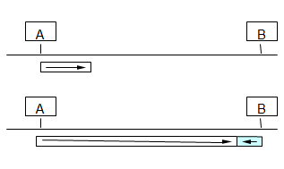
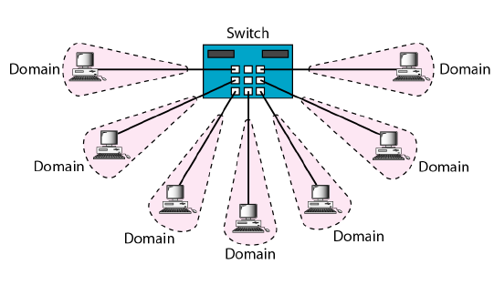

Please refer to textbook [chapter 13](https://github.com/cnchenpu/data-comm/blob/master/ppt/Ch13-Forouzan.ppt).

# General Network Issues (Pro and Con)
- Selecting the transmission medium
  - Wired
  - Wireless
- Selecting the link configuration
  - Point-to-point
    - dedicated link for users high, predictable performance
    - need many links, planning of end-points
  - Point-to-multipoint
    - cover multiple users with single link
    - requires sharing of medium: Media Access Control protocol for multiple access
      -  allow one station to use the shared medium at a time 
- Coverage area
  - LAN
  - WAN
  - Backbone
- Network topology
  - Mesh
    - each pair of nodes have dedicated point-to-point link
    - complex and expansive for large network
    - addresses not needed in frames
  - Bus
    - early Ethernet 
    - single multipoint link connects all stations
    - require protocols to share medium
    - faulty link stops all communications
    - limited number of stations
  - Ring
    - Token Ring
    - same as Bus topology
  - Star
    - today most LAN use Star topology
    - fault tolerance for links

# IEEE 802 LAN Architecture
- Physical (PHY) Layer
- Data Link (DL) Layer
  - Logical Link Control (LLC)
    - addressing, connecting to other networks
  - Media Access Contorl (MAC)
    - efficient data transfer, sharing the medium
- EX: IEEE 802.3 (Ethernet), IEEE 802.5 (Token Ring), IEEE 802.11 (WiFi), IEEE 802.15.1 (Bluetooth), IEEE 802.16 (WiMax),... 

# IEEE 802.3 Ethernet
- Most popular packet-switched LAN technology
- Bandwidths: 10Mbps, 100Mbps, 1Gbps, 10Gbps
- Max bus length: 2500m 
  - 500m segments with 4 repeaters
- [1-persistent](https://github.com/cnchenpu/data-comm/blob/master/24_data-comm_datalink-MAC.md#how-to-sense-the-media-is-busy-or-available) [CSMA/CD](https://github.com/cnchenpu/data-comm/blob/master/24_data-comm_datalink-MAC.md#carrire-sense-multiple-access-with-collision-detection-csmacd)
  - listens to line before/during sending
  - If line is idle (no carrier sensed)
    - send packet immediately
  - If line is busy (carrier sensed)
    - wait until idle and transmit packet immediately (1-persistent)
  - If collision detected
    - Stop sending and jam signal
    - Try again later

## IEEE 802.3 MAC frame format

- A valid Ethernet frame size is from  64  to  1518  bytes.
- Preamble: 56 bits (7 bytes) of alternating 1s and 0s 
  - define in physical layer
- Start Frame Delimiter (SFD): 10101011 (1 byte)
- Destination Address (DA): MAC address of receiver 
  - 6 bytes
- Source Address (SA): MAC address of self (sender) 
  - 6 bytes
- Type: Identify the protocol type of upper layer, EX: ARP.
  - 2 bytes
- Data: Data from upper layer
  - minimum payload length: 46 bytes
  - maximum palyoad length: 1500 bytes
  - divide data into multiple frames if data length larger than the limitation
  - The largest possible payload in a frame is called the Maximum Transmission Unit __(MTU)__
    - Jumbo Frame
- CRC: CRC check - 4 bytes.

## Why Ethernet frames must be at least 64 bytes long?
- Because the need of Collision Detection.
  - The maximum distance of Ethernet is 2500m between hosts.
    - Assume the speed of electron is 2x108 m/sec (speed of light is 3x108 m/sec).
    - So 2500m needs 25 &mu;s, we use 25.6 &mu;s.
  - The frame must be alive in 2 times (a round-trip) of longest transmission time for collision detection.
    - So a round-trip time (RTT) needs 2x25.6 = 51.2 &mu;s.
  - For 10Mbps Ethernet, it need 0.1 &mu;s for 1 bit, so 51.2 &mu;s can send 512 bits, that is 64 bytes.
  - Fast Ethernet has the same 64 byte minimum frame size but can get bits out 10 times faster.
    - RTT: 5.12 &mu;s
    - Shorter the network range.
  

## Jumbo Frame
- Larger MTUs allow greater efficiency in data transmission since each frame carries more user data (payload) while protocol overhead and underlying per-packet delay remain fixed. 
- The effective use of Jumbo frames requires that every link along the network path support the same Jumbo frame MTU.
- Application:
  - Server Clustering  
  - Server Backups (larger MTUs permit faster backups) 
  - High Speed Supercomputer Interconnect (for data transfer, not messaging) 
  - Network File Server (NFS) Protocol (9000 byte MTU to carry an 8192 NFS data block) 
  - iSCSI SANs (9000 bytes to reduce the effect of TCP frame overhead) 
  - FCoE SANs (2500 bytes to enclose an FC frame of 2000 bytes) 
- Sending data in Jumbo frames results in fewer frames being sent across the network. 
- Processing fewer frames generates conservation of CPU cycles and thus greater throughput.

- Larger frames consume more Ethernet link transmission time, causing greater delays for those packets that follow and thus increasing latency.      
- This could have a negative consequence for applications that require low latency and consist of smaller packet sizes such as Voice over IP.

# MAC address

- Ethernet (48 bits, 6 bytes) 
- Unicase address
  - A3:34:45:11:92:F1
- Multicase address
  - A2:34:45:11:92:F1
- Broadcase address
  - FF:FF:FF:FF:FF:FF

# Evolution of Ethernet

- Bandwidth Enhancement
  - comptible: not change frame format
  - higher speed, shorter transmission range
- Reapter
  - layer 1 intermediate system (acts on bits)
  - enlarge the signal power to extend the network range
  - the same collision domain
- Bridge Ethernet (Layer 2 Switch)
  - connect 2 segments (the same protocol)
  - layer 2 intermediate system
  - forward layer 2 broadcast
  - seprate collision domains
  - use MAC address for switching
  - keep the mapping of MAC addresses and switch ports
  - use broadcast to find the MAC address if it not found in table
  - Bridging: software based
  - LAN switching: hardware (ASIC) based

  
- Layer 3 Switch (IP Switch, Switch Router)
  - keep routing table  
  - use IP address for switching
  - limit the broadcast packets
- Virtual LAN
  - 802.1q
  - use VLAN tags for switching

- Full-Duplex Switched Ethernet
  - send and receive data at the same time
  - each station is connected to the switch via two seprate links
  - each link is a point-to-point dedicated path between the station and the switch
  - CSMA/CD is not needed
  

