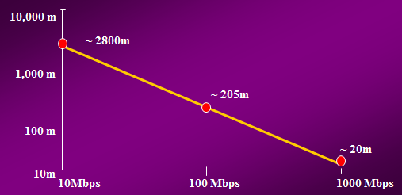
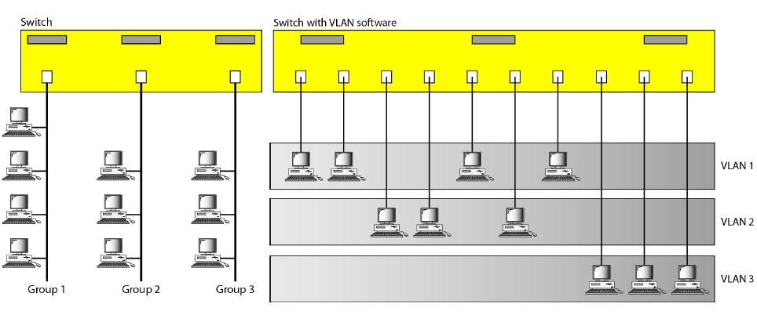

# Fast Ethernet (IEEE 802.3u) 100BaseTx
- Fast Ethernet uses the same frame formats and CSMA/CD technology as normal 10Mbps Ethernet. 
- Network distance: 100m.
- The difference is that the maximum delay for the signal across the segment is now 5.12 &mu;s instead of 51.2 &mu;s.
  - [Why Ethernet frames must be at least 64 bytes long?](https://github.com/cnchenpu/data-comm/blob/master/25_data-comm_LAN.md#why-ethernet-frames-must-be-at-least-64-bytes-long)
- The Inter-Packet Gap (IPG) for 802.3u is 0.96 &mu;s as opposed to 9.6 &mu;s for 10Mbps Ethernet. 

# Gigabits Ethernet (IEEE 802.3ab) 1000BaseT
- Network distance: 100m.
- The inter-packet gap is 96 ns.

## For a given minimum-length frame, the extent of a network scales inversely with data rate.

# Virtual LAN (VLAN)
- a switched network that is logically segmented
- a broadcast domain that exists within a defined set of switches

