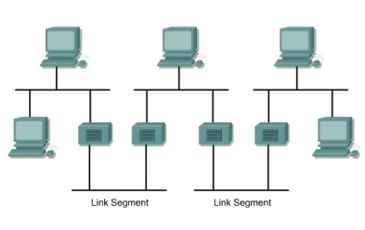
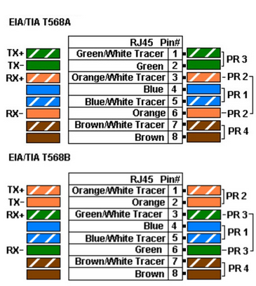
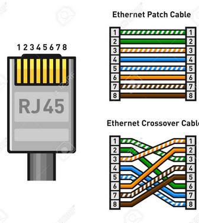
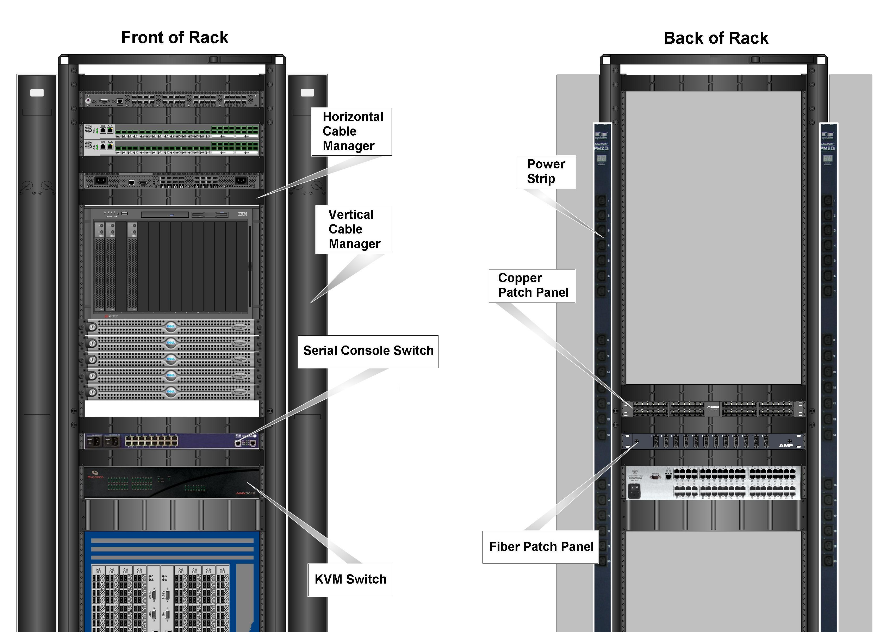

# The 5-4-3 rule for Ehternet Networking
- 5 segments with 4 repeaters, and no more than 3 of the 5 network segments can be for end-uses.

# Twisted Pair Cables cabling
- Unshielded Twisted Pair Cable (UTP)
- Shielded Twisted Pair Cable (STP)
- Wire standard
  - CAT 4: up to 16 Mbps, full-duplex
  - CAT 5: up to 100 Mbps, full-duplex
  - CAT 6: up to 1000 Mbps, full-duplex
- Connector: RJ-45
  - T568A and T568B
  
  
    
  - Straight Through cable: connect T568A and T568A or connect T568B and T568B. 
  - Cross-over cable: connect T568A and T568B.
  
  

# Network Cabling

- Cable Manager
- Patch Panel
- Cooling System
- Overhead Cable Pathway
- ...
- A practice guide: [Cabling the Data Center](https://www.brocade.com/content/dam/common/documents/content-types/product-design-guide/cabling-best-practices-ga-bp-036-02.pdf)

