Please refers to textbook [chapter 15](https://github.com/cnchenpu/data-comm/blob/master/ppt/Ch15-Forouzan.ppt).

# Wireless LAN (IEEE 802.11)
- [CSMA/CA](https://github.com/cnchenpu/data-comm/blob/master/24_data-comm_datalink-MAC.md#carrire-sense-multiple-access-with-collision-avoidance-csmaca)

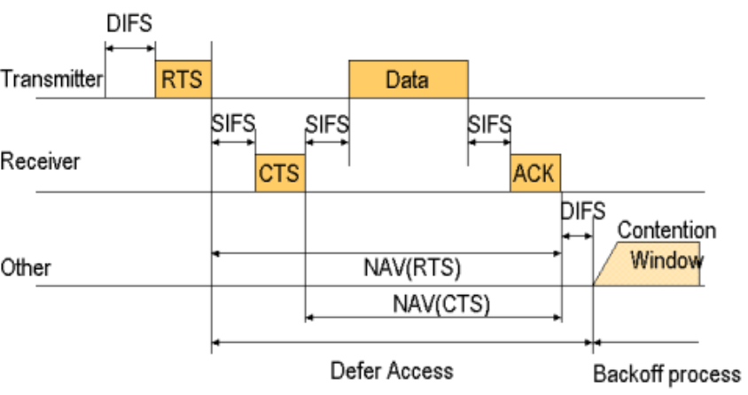

  - DIFS: Distributed inter-frame space
    - a wait-time before transmission for coordination
  - RTS: Request To Send
  - SIFS: Short Inter-Frame Space
    - a wait-time before RTC, CTS and ACK
  - CTS: Clear To Send
    - inform sender that I am ready to receive your data, and tell others I am busy (to avoid collision)
  - ACK: Acknowledgement
  - NAV: Network Allocation Vector
    - control other nodes not to send data
  - Contention Window
    - random backoff time (to avoid collision)
  
- Ad hoc (Peer-to-Peer)
  - connect without __Access Point (AP)__
- Infrastruct
  - single access point: __Basic Service Set (BSS)__
  - multiple access point: __Extend Service Set (ESS)__
  
  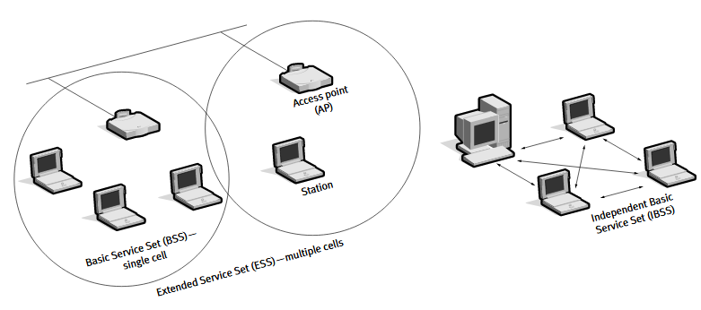

## 802.11 a/b/g/n/ac
- 802.11a
  - uses 5-GHz band
  - 54Mbit/s

- 802.11b
  - uses 2.4-GHz band
  - 11Mbit/s
  
- 802.11g
  - uses 2.4-GHz band
  - 54Mbit/s
  
- 802.11n
  - uses 2.4-GHz and 5-GHz band
  - 72~150Mbit/s
  
- 802.11ac
  - uses 5-GHz band
  - 87~866Mbit/s
  
## WLAN Frame Format
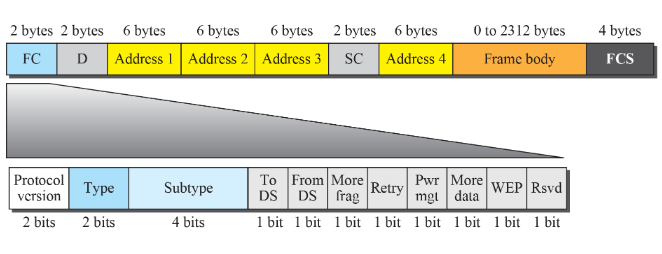

## WLAN Addressing Mechanism
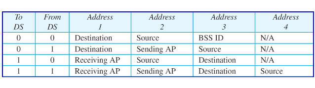

- case 1: A to B directlly (in the same BSS)

  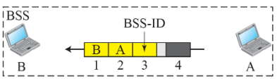

- case 2: A to AP (different BSS)

  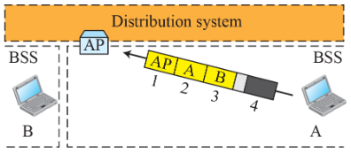

- case 3: AP to B (different BSS)

  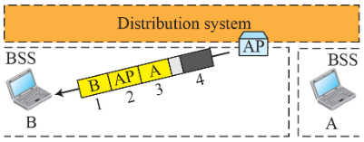

- case 4: AP tp AP (different BSS)

  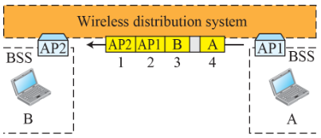

## The hidden terminial problem
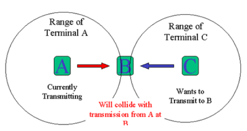

## The exposed terminal problem
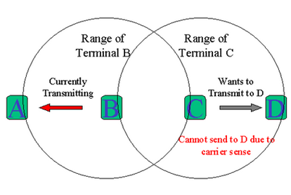

- RTS (Request to Send) / CTS (Clear to Send) - Collision-Avoidance
  - Sender transmits special Request-to-send (RTS) packet: the packet contains the length of data to be sent, L.
  - Receiver replies with Clear-to-send (CTS) packet: this packet also contains the length of data (same as before).
  - Every node hearing the RTS remains quiet for CTS+L.
  - Every node hearing the CTS remains quiet for L.
  - If sender does not receive CTS, it knows the receiver is busy and does not transmit data.
  - CTS/RTS packets may still collide, but they are small, so the probability of collisions is reduced.
  
  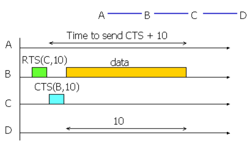
  
## Mobile IP
  - Roaming issue 
  - Home Agent(HA): A router on the home network which represents the MN while it’s not attached to the home network
  - Home Address (HoA): A (static) IP address out of the mobile nodes home network
  - Foreign Agent(FA): new visited place and provides Care of Address (CoA)
  - Mobile Node(MN)
  - Correspondent Node(CN): send message to MN
  - Care-of-Address(CoA): physical IP address of a MN while visiting a foreign network
  - Binding: association of the home address with the Care-of-address of a MN

  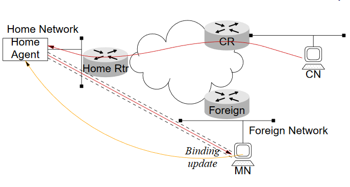
  
- MN connects to foreign network and gets a CoA
- MN sends binding updateto HA
- HA uses proxy neighbor discovery (ARP) to represent the MN in the home network
- Every traffic destined to the MN will be encapsulated in a IPv6-in-IPv6 Tunnel and send to the CoA of the MN
  
  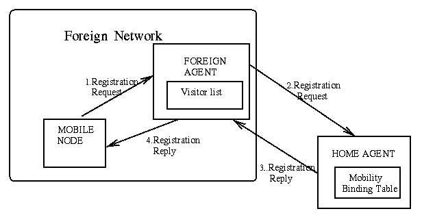
  
  
  
## Wireless LAN security threats
- Signal interception - sniffing
- Unauthorized network access
- Unauthorized AP - no access control and direct access to the intranet behind firewall
- Denial of service - logical attackes with signal jamming
- AP spoofing

  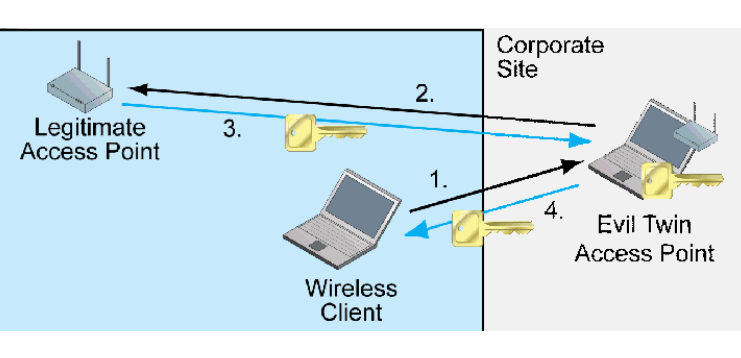

# Bluetooth vs. 802.11b
- Both technologies use the 2.4 GHz radio frequency for wireless communications.
- Bluetooth technology is focused on replacing the short cables used to connect consumer electronic devices such as keyboards and mouse devices.
- Bluetooth's range is limited to approximately 3 m to 9.1 m with a raw data rate of 1 Mbps/723 Kbps available.
