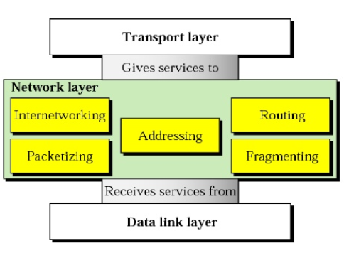
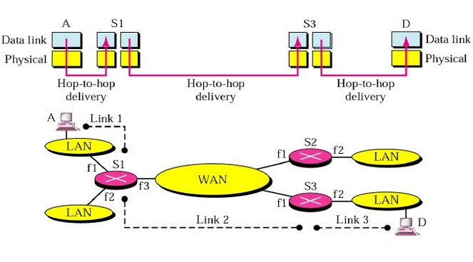
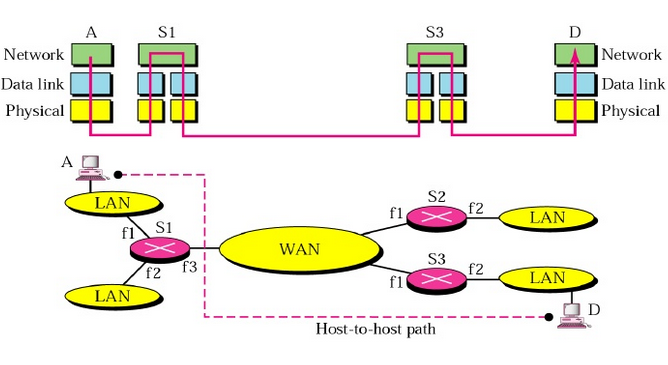
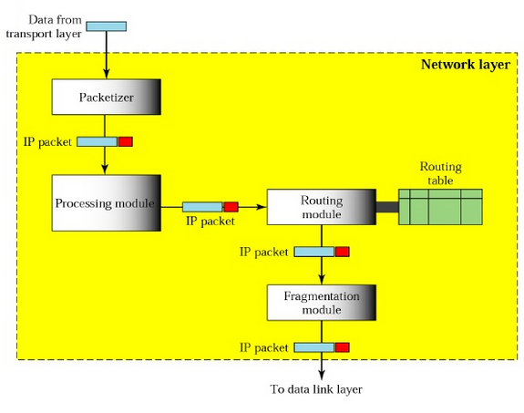
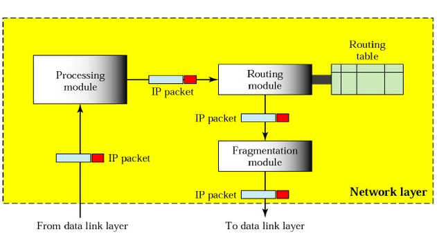
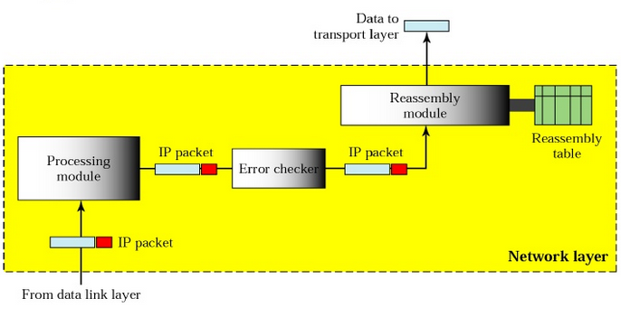
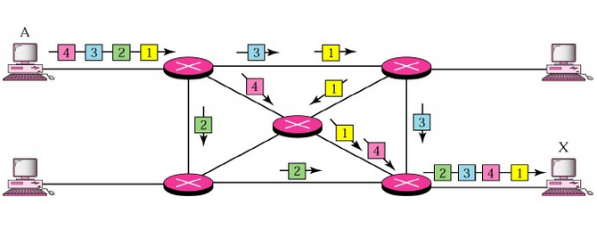

# Netwprk Layer

## Inter-Networking
- Hop-to-Hop

    

- Host-to-Host

    

## Network Layer at source

## Network Layer at router

## Network Layer at destination

## Switching
[ch.8](https://github.com/cnchenpu/data-comm/blob/master/17_data-comm_switch.md#switching)

- Circuit switching
    + Connection Oriented
- Packet switching
    + Virtual Circuit switching
    + Datagram switching
        + Connectionless

