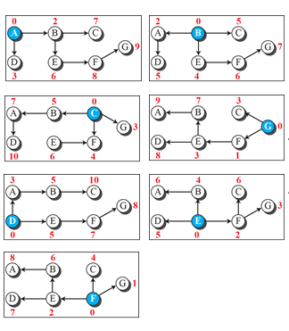
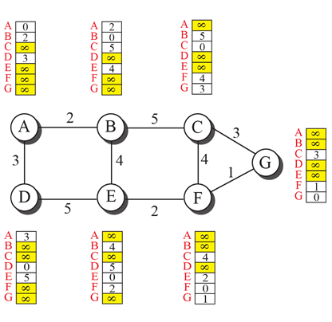

# Routing Protocol
## Least-Cost Routing
- Internet is modeled as a weighted graph
- Find the least cost between the source to the destination router
- The source router chooses a route to the destination router in such a way that the total cost for the route is the least cost among all possible routes. 

# Routing Algorithm
## Bellman-Ford Equation
- __D_ij___ is the shortest distance and __c_ij___ is the cost between nodes ___i___ and ___j___.

## Distance Vector Algorithm
- each node creates is its own least-cost tree about its immediate neighbors
- exchange information between immediate neighbors to make the tree more and more complete

## Link State Algorithm
