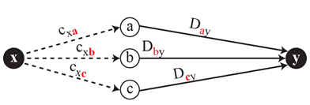
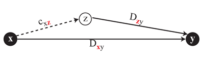
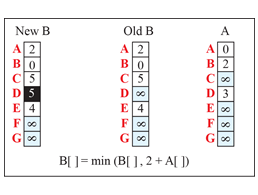
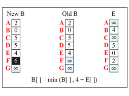
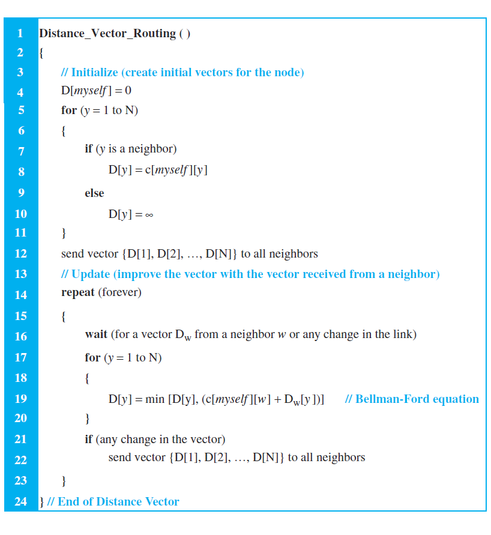
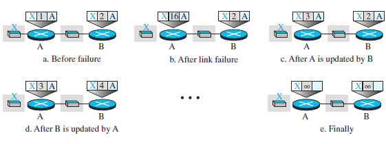

# Routing Protocol
## Least-Cost Routing
- Internet is modeled as a weighted graph
- Find the least cost between the source to the destination router
- The source router chooses a route to the destination router in such a way that the total cost for the route is the least cost among all possible routes. 

# Routing Algorithm
## Bellman-Ford Equation
  - __D_ij___ is the shortest distance and __c_ij___ is the cost between nodes ___i___ and ___j___.
- __D_xy_ = min{(c_xa_ + D_ay_), (c_xb_ + D_by_), (c_xc_ + D_cy_),...}__

- __D_xy_ = min{D_xy_, (c_xz_ + D_zy_)}__

## Distance Vector Algorithm
- each node creates is its own least-cost tree about its immediate neighbors
- exchange information between immediate neighbors to make the tree more and more complete

- B receives a copy of A’s vector

  

- B receives a copy of E’s vector

  

### Problem of Distance Vector Algorithm
- Count to Infinity
  - if a link is broken (cost becomes infinity), every other router should be aware of it immediately, but in distance-vector routing, this takes some time
- Two-Node Loop
  - 

### Solution of problem of Distance Vector Algorithm
- Split Horizon
  - if node B thinks that the optimum route to reach X is via A, it does not need to advertise this piece of information to A
  - In our scenario, node B eliminates the last line of its forwarding table before it sends it to A. In this case, node A keeps the value of infinity as the distance to X. Later, when node A sends its forwarding table to B, node B also corrects its forwarding table.

## Link State Algorithm
