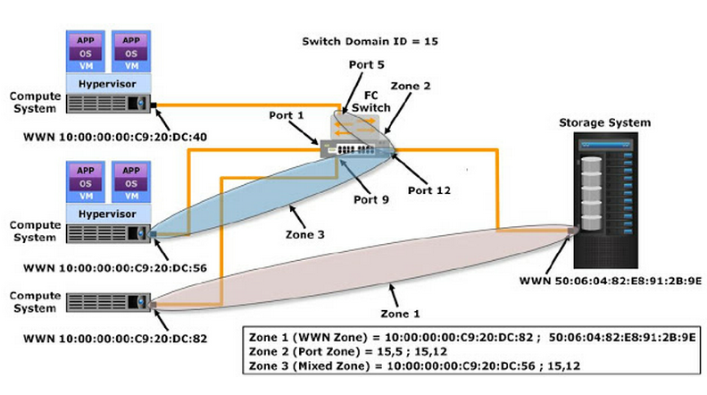
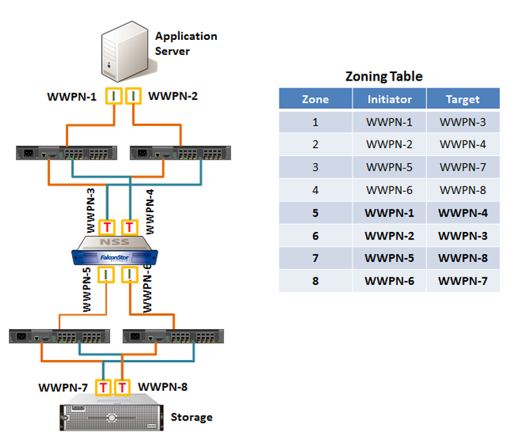
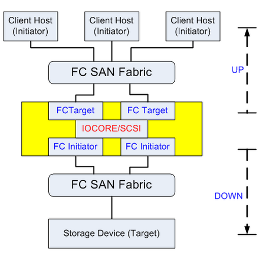
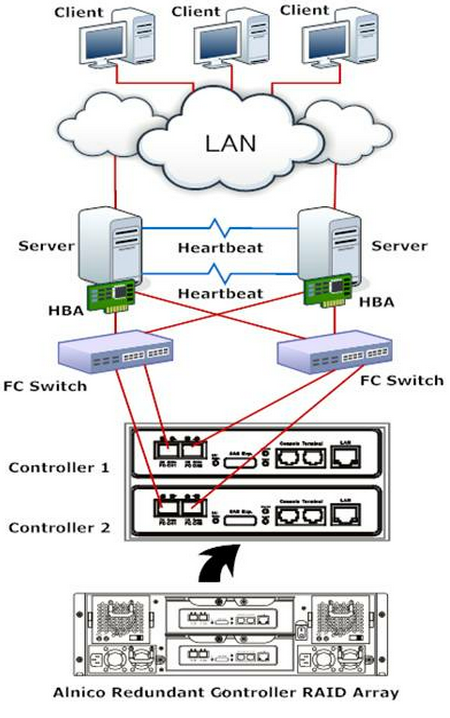
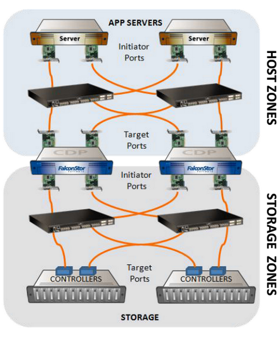

# Fibre Channel 

## Fabric
A Fibre Channel fabric is simply a network consisting of one or more Fibre Channel switches.  If you have just one switch that’s ok it’s still a fabric.  In larger networks you would interconnect many switches in a topology to provide higher throughput and availability in the event one or more switches fail.

## Initiator
An initiator is the consumer of storage, typically a server with an adapter card in it called a Host Bus Adapter (HBA).  The initiator “initiates” a connection over the fabric to one or more ports on your storage system which are called target ports.

## Target
Target ports are the ports on your storage system which deliver storage volumes (called target devices or LUNs) to the initiators

> Note that initiators do not talk to initiators and targets do not talk to targets.

## WWN
In Fibre Channel there’s a special term for a port identifier, specifically WWN or World Wide Name.  Just as every network card as a unique MAC address for each NIC port, every single FC port has a unique 64bit port WWN.  For example, a FC port WWN might look like this: 20:00:00:81:23:45:ac:01.

## FC Ports

!p[(fig/FC_ports.png)

## Zone
A zone is simply a list of IDs containing an initiator port ID and one or more target port IDs.  It’s like setting up virtual cabling or paths so that there’s a data path from the initiators to the targets.

# Up-stream & Down-stream

# High Available

