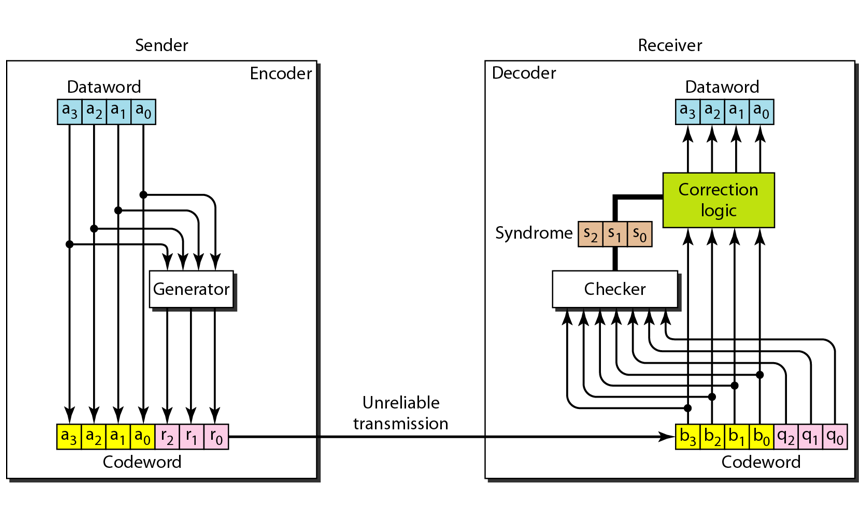

## Hamming code
- EX: C(7,4)

|Data-word|Code-word|Data-word|Code-word|
|:----:|:----:|:----:|:----:|
|0000|0000 <b>000</b>|1000|1000 <b>110</b>|
|0001|0001 <b>101</b>|1001|1001 <b>011</b>|
|0010|0010 <b>111</b>|1010|1010 <b>001</b>|
|0011|0011 <b>010</b>|1011|1011 <b>100</b>|
|0100|0100 <b>011</b>|1100|1100 <b>101</b>|
|0101|0101 <b>110</b>|1101|1101 <b>000</b>|
|0110|0110 <b>100</b>|1110|1110 <b>010</b>|
|0111|0111 <b>001</b>|1111|1111 <b>111</b>|

- r0 = a2 + a3 + a0  modulo 2
- r1 = a3 + a2 + a1  modulo 2
- r2 = a1 + a0 + a3  modulo 2

- s0 = b2 + b1 + b0 + q0 modulo 2
- s1 = b3 + b2 + b1 + q1 modulo 2
- s2 = b1 + b0 + b3 + q2 modulo 2

|Syndrome|000|001|010|011|100|101|110|111|
|:----:|:----:|:----:|:----:|:----:|:----:|:----:|:----:|:----:|
|Error|None|q0|q1|b2|q2|b0|b3|b1|
